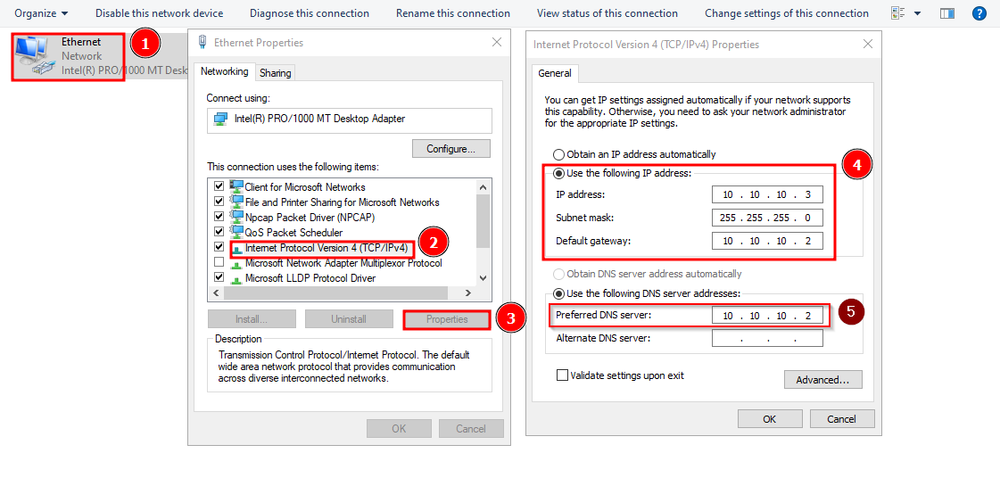

## Introduction

While I was first setting up my malware analysis lab I had to do some tedious troubleshooting and searching for information yielded too little (sometimes too much) information about how to properly set up an internal network so in an attempt to help those who just want to set up the lab (and to keep the notes of the process to myself) I wrote this post.

We will be setting up an [Internal Network](https://docs.oracle.com/en/virtualization/virtualbox/6.0/user/network_internal.html) with [virtualbox](https://www.virtualbox.org/) running on a [Windows](https://www.microsoft.com/en-us/windows) host (the process for a Linux host machine is virtually the same) that will allow network interactions between a [Remnux](https://remnux.org/) VM and a [Windows](https://www.microsoft.com/en-us/windows) VM.

The end result will be something like this:


## Host Machine Setup

### Create Internal Network in VirtualBox App

This step should be done in both the remnux and the windows virtual machines.

- Open the Virtual Machine settings
- Select the Network Tab
- Select Internal Network in the drop down menu
- Rename the default intnet name to whatever you want to (malware in our case)


### Create a DHCP server with vboxmanage.exe

First we must find vboxmanage.exe, it should be located in this location __C:\Program Files\Oracle\VirtualBox__ if you chose the default installation path *Note: It must be run with cmd.exe as powershell has some issues parsing the flags*

Now run the following command:
```cmd
vboxmanage.exe dhcpserver add —netname malware —ip 10.10.10.1 —netmask 255.255.255.0 —lowerip 10.10.10.2 —upperip 10.10.10.5 —enable
```
You can run the following command to verify that the new DHCP server has been correctly created.
```cmd
vboxmanage.exe list dhcpserver
```

## Analysis VM (Remnux v7) Configuration.

### Install ifupdown
This step is pretty straight forward, just run:
```bash
sudo apt install ifupdown
```
### Configure the /etc/network/interfaces file
First we need to get the interface's name:
```bash
ifconfig
```
The Name of the interface should be something like "__enp0s3__", knowing the name now we can edit the "/etc/network/interfaces" file by adding the following (if the file does not exist, reboot the VM after installing ifupdown) :
```bash
auto enp0s3
iface enp0s3 inet static
	address 10.10.10.2
	netmask 255.255.255.0
```

## Windows VM Configuration.

Now we must assign an IP to our Windows VM and set our Analysis VM as the [Default Gateway](https://en.wikipedia.org/wiki/Default_gateway).

Go to __Control Panel > Network and Sharing Center > Change Adapter Settings__ then:

- Right Click the interface and select properties.
- Select Internet Protocol Version 4 and click Properties.
- Manually configure the IP address, subnet mask, DHCP server and the Preferred DNS Server.



## Conclusion

And that's all, after all this setup network interactions coming from the infected Virtual Machine will go through the Analysis Machine while being completely isolated from your host's network, you can now analyze the traffic or even simulate responses to the malware requests using tools like FakeDNS and inetsim :)

Happy Hunting!