## Introduction

We will be analyzing a sample of the infamous ransomware "wannacry" and it's behavior and effects in our system, this is not meant to be an analysis of it's cryptographic functions nor a complete reverse engineering of the malware.

We must remember that our objective as malware analysts is to provide information needed to detect, prevent and contain further intrusions that means determining exactly what happened and detecting all the infected machines and examining suspicious files in order to generate useful host/network based signatures to detect and prevent infections in our systems, when falling into a rabbit hole of reverse engineering one must remember what our main objective as analysts is.

## Sample Details

| Hashes | |
| ---- | ---- |
|md5 | DB349B97C37D22F5EA1D1841E3C89EB4 |

Detection Results:
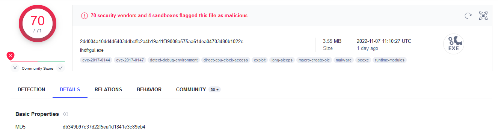

## Tools Used

```text
- VirtualBox
- pedump
- die (Detect it Easy)
- PEstudio
- ida64
- Ghidra
- Regshot
- Procmon
- Autoruns
- Process Hacker
- x32dbg
- fakeDNS
- InetSim
- Caffeine
```

## Basic Static Analysis

Let's begin by doing some basic analysis of the PE to see what can we learn examining it's headers and section data.

### PE Properties
```text
remnux@remnux:~/malware/wannacry$ file wannacry.exe
wannacry.exe: PE32 executable (GUI) Intel 80386, for MS Windows
```
The PE has some suspicious resources embedded in it so it's worth checking them out.
```text
=== SECTIONS ===
(...snip...)
  .rsrc      310000   35a454   35b000    32000     0        0     0        0  40000040  R-- IDATA

=== RESOURCES ===
FILE_OFFSET    CP  LANG     SIZE  TYPE          NAME
    0x320a4  1252 0x409  3514368  R             #1831
    0x38c0a4  1252 0x409      944  VERSION       #1
```
As seen in the image below the resource named "1831" is clearly another PE as it has the then PE file signature (hex 4d 5a, ascii MZ) and the DOS stub.
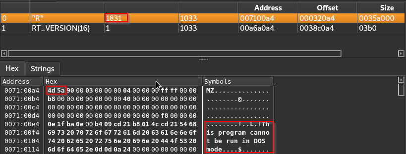

### Import Table Analysis

The PE is not packed as imports are visible and numerous this allows us to make some educated guesses of it's functionality without resorting to dynamic analysis.

#### Interesting and Suspicious Imports
```text
ADVAPI32.dll - StartServiceCtrlDispatcherA - Locating this function in malware tells that the function should be run as a service.
ADVAPI32.dll - OpenSCManagerA - Any program that installs,modifies, or controls a service must call this function before any other service-manipulation function.
ADVAPI32.dll - CreateServiceA - Malware uses CreateService for persistence, stealth, or to load kernel drivers.
ADVAPI32.dll - CryptAcquireContextA - Initializes the use of Windows encryption.
KERNEL32.dll - CreateFileA
KERNEL32.dll - LoadResource - Loads a resource from a PE file into memory. 
KERNEL32.dll - FindResourceA
KERNEL32.dll - GetProcAddress - Used to import functions from other DLLs in addition to the functions imported in the PE file header.
KERNEL32.dll - GetModuleHandleW - Locate and modify code in a loaded module or to search for a good location to inject code.
KERNEL32.dll - GetModuleFileNameA - Malware can use this function to modify or copy files in the currently running process.
KERNEL32.dll - GetTickCount - Sometimes used to gather timing information as an anti-debugging technique but is often added by the compiler.
```
The imports above already give us a hint of the malware's functionality, we can predict that it creates and starts a service, deals with encryption in some way, loads a resource and dynamically load some other functions that we can't currently see but are probably related to dropping the payload i.e. WriteFile

With that information and the fact that there's a PE in the resource section it wouldn't be wild to say that it's functionality is to drop a payload somewhere in the targeted box.

#### Networking Capabilities

Based on the imported DLLs we see that the malware has Low-Level networking capabilities i.e. opening sockets.

```text
- 3 (closesocket)	ws2_32.dll
- 16 (recv)	ws2_32.dll
- 19 (send)	ws2_32.dll
- 8 (htonl)	ws2_32.dll
- 14 (ntohl)	ws2_32.dll
- 115 (WSAStartup)	ws2_32.dll
- 12 (inet_ntoa)	ws2_32.dll
- 10 (ioctlsocket)	ws2_32.dll
- 18 (select)	ws2_32.dll
- 9 (htons)	ws2_32.dll
- 23 (socket)	ws2_32.dll
- 4 (connect)	ws2_32.dll
- 11 (inet_addr)	ws2_32.dll
```
and it has also high-level capabilities , high-level capabilities have the advantage of blending in with regular traffic but the disadvantage that the User-Agent header must be manually provided providing us with the opportunity of extracting a potential network indicator for our detection signatures.
```text
WININET.dll - InternetOpenA	User-Agent, Initializes the high-level Internet access functions from WinINet,
WININET.dll - InternetOpenUrlA
```
### Strings

Analyzing the strings can algo give us very good indicators and hints for the functionality of the malware in this case we can see messages in different languages (very considerate!) and possible names of configuration files.
```text
b.wnry
c.wnry
1AgG
msg/m_bulgarian.wnry
"t=)
msg/m_chinese (simplified).wnry
"t=.|Vbq-
msg/m_chinese (traditional).wnry
"t=.
msg/m_croatian.wnry
msg/m_czech.wnry
msg/m_danish.wnry
msg/m_dutch.wnry
msg/m_english.wnry
```
Some suspicious exe names.
```
taskdl.exe
taskse.exe
diskpart.exe
```
Probably a dynamically loaded DLL using LoadLibrary.
```
USER32.DLL
```
Weird strings that are good for creating signatures (Note:  even though they are local IPs they are defanged, good habits save lives!)
```text
Windows 2000 2195
Windows 2000 5.0
\\172[.]16[.]99[.]5\IPC$
Windows 2000 2195
Windows 2000 5.0
\\192[.]168[.]56[.]20\IPC$
kernel32.dll
WanaCrypt0r
Software\
```
Lot's of extensions names, probably used to identify which files to encrypt.
```text
(...snip...)
.jpeg
.vcd
.iso
.backup
.zip
(...snip...)
```
And finally a weird Url (spoiler alert, it's the infamous killswitch)
```
hxxp[://]www[.]iuqerfsodp9ifjaposdfjhgosurijfaewrwergwea[.]com
```
All those strings give us some really indicators that we can use to build up out detection signatures.

## Dynamic Analysis

Having performed our static analysis now it's time to see what this piece of malware does in action.

### Killswitch On

If we setup an internal network and redirect all dns queries to a box that we control (ass seen below using fakedns, and inetsim) we immediately see a query to the strange URL that we found earlier
```bash
remnux@remnux:~/malware/wannacry$ fakedns
fakedns[INFO]: dom.query. 60 IN A 10.10.10.2
fakedns[INFO]: Response: www[.]iuqerfsodp9ifjaposdfjhgosurijfaewrwergwea[.]com -> 10.10.10.2

Inetsim report:
2022-11-08 14:48:48  HTTP connection, method: GET, URL: hxxp[://]www[.]iuqerfsodp9ifjaposdfjhgosurijfaewrwergwea[.]com/
```
Interestingly that seems to prevent the malware from executing any further let's try to see whats going on under the hood.

A quick way to reach the part of the code that makes the request is to search for the Xrefs to InternetOpenA. (which we know is being used based on our analysis)
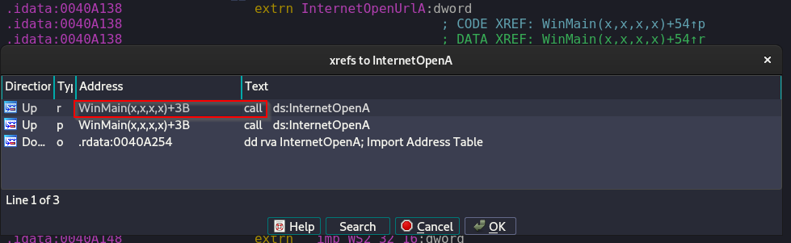

That leads us to a function that ida64 has labeled WinMain, where we can see that our suspicious url being loaded as a parameter.
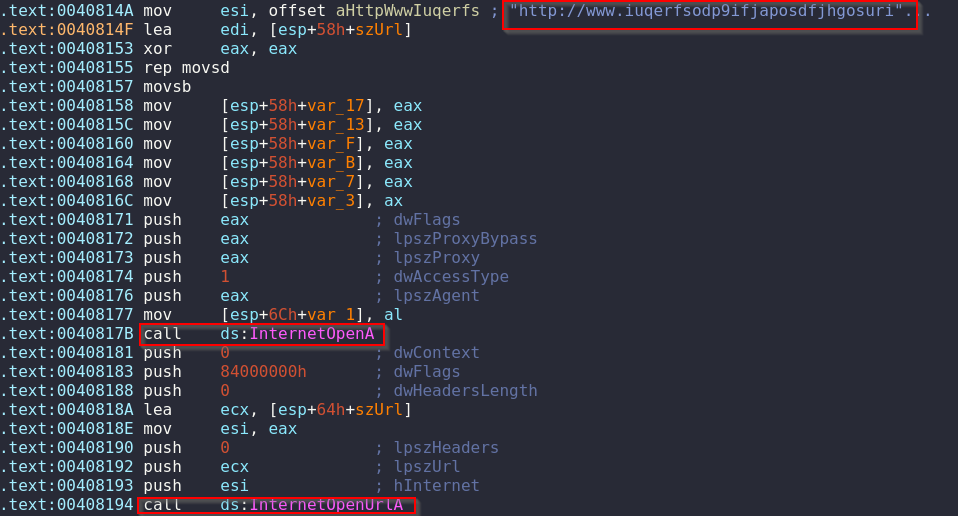

We can see the result of InterOpenUrlA being copied into the edi register which then is checked to see if it's value is 0.
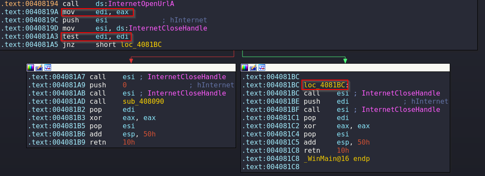

InternetOpenUrlA returns a valid handle to the URL if the connection is successfully established, or NULL if the connection fails, so if the URL is found the value will be non 0 which means that the program is going to jump to loc_4081BC where we will meet a dead end in order to take the other path the URL must be unreachable so that function 408090 will be called.

### Killswitch Off

#### Running the Malware
After making sure that the URL will not be reached the malware now after running wht malware we can see the following hellscape where our beloved files will be now encrypted, our wallpaper changed and a truly obnoxious window with the payment instructions has been spawned.
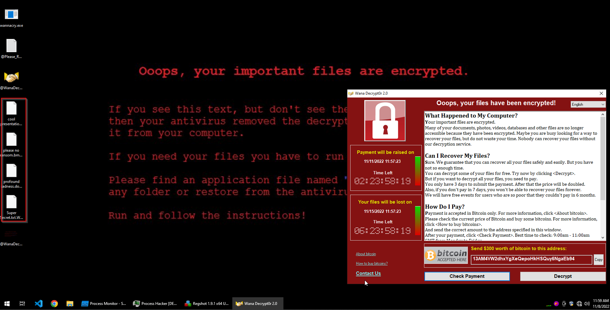

#### Dropping the Payload

Procmon reports that the WriteFile operation has been called by wannacry.exe.
```text
wannacry.exe WriteFile C:\Windows\taskche.exe
```
The WriteFile function was dynamically loaded as we can see in the image below, that's why we couldn't see it before.

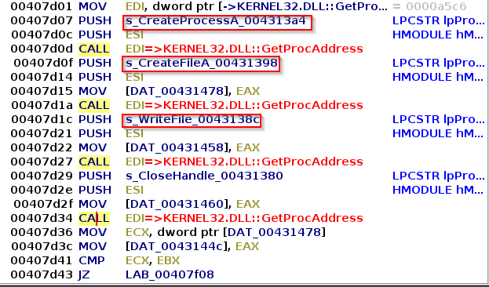

and then it's being called to write tasksche.exe to the disk as seen below.

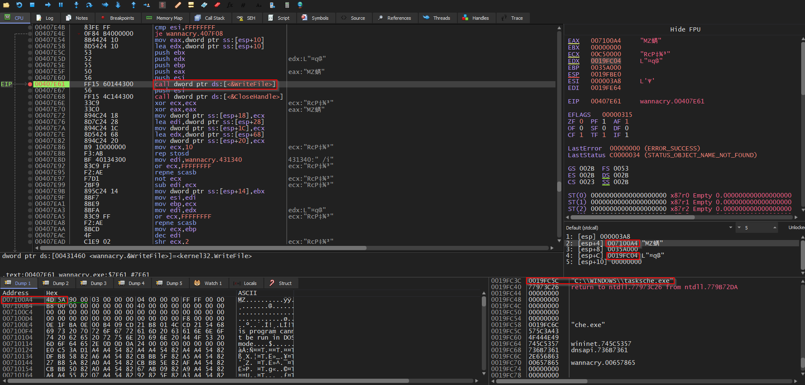

Examining the call to WriteFile with x32dbg we can analyze what and where it writes, the second argument (eax register) is the the executable found in the resource section (shown in the dump) and the fourth argument (edx register shown below in the stack) is the location and name in which it will be written.

#### Registry Changes

Using RegShot we can get check the registry for modifications.
```text
----------------------------------
Keys added: 21
----------------------------------
HKLM\SOFTWARE\WOW6432Node\WanaCrypt0r

HKLM\SYSTEM\ControlSet001\Services\mssecsvc2.0
HKLM\SYSTEM\ControlSet001\Services\wcjlbgmjfcfjhcv579

HKLM\SYSTEM\CurrentControlSet\Services\mssecsvc2.0
HKLM\SYSTEM\CurrentControlSet\Services\wcjlbgmjfcfjhcv579
```
It seems that a service has been created, we already guessed that based on the imports and we can confirm it by quickly debugging the PE and checking how it calls CreateService as seen below.

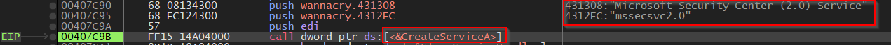

Wen can also see a value added to CurrentVersion\Run\ which is a common way in which malware achieves persistence.

NOTE: We will later examine when analyzing the payload where that weird "wcjlbgmjfcfjhcv579" comes from.
```text
----------------------------------
Values added: 47
----------------------------------
HKLM\SOFTWARE\WOW6432Node\Microsoft\Windows\CurrentVersion\Run\wcjlbgmjfcfjhcv579: ""C:\ProgramData\wcjlbgmjfcfjhcv579\tasksche.exe""
HKLM\SOFTWARE\WOW6432Node\WanaCrypt0r\wd: "C:\ProgramData\wcjlbgmjfcfjhcv579"
```
Quickly checking autoruns confirms that indeed the malware achieves persistence by these means.


We can even see evidence of how it changed our beautiful wallpaper.
```
HKU\S-1-5-21-125203715-1897566060-139690607-1001\SOFTWARE\Microsoft\Windows\CurrentVersion\Explorer\Wallpapers\BackgroundHistoryPath0: "C:\Users\Euryale\Desktop\@WanaDecryptor@.bmp"
```
#### Running Processes
Checking the running processes we can see the following.
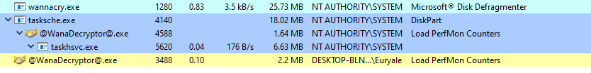

Using Procmon we see that the dropper started the tasksche.exe process.
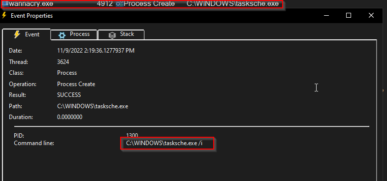
the process was launched with the /i argument, which could pretty mean install.

In the next post we will analyze the "tasksche.exe" PE and solve some mysteries left like the weird random name and what does the /i argument does.

Lux-Sit