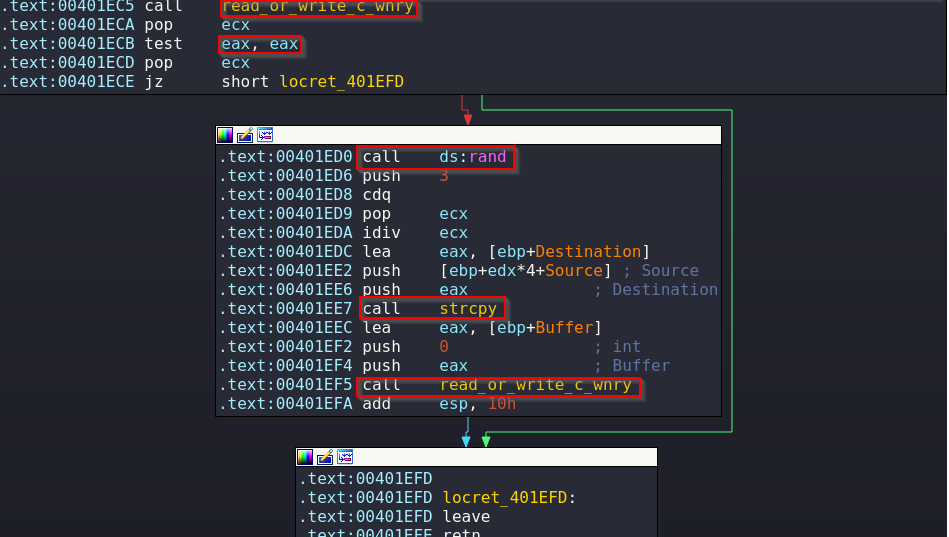

## Introduction

In this part of the Wannacry malware analysis we will have a look at the launcher that is dropped by the malware component that we analyzed in [part - 1]()

## Sample Details

| Name | |
|---|---|
|tasksche.exe| |

| Hashes | |
| ---- | ---- |
|md5 | 84c82835a5d21bbcf75a61706d8ab549 |

Detection Results:


Now let's just verify that tasksche.exe is actually the same resource that we first saw when performing the static analysis.

```bash
pedump wannacry.exe --extract resource:0x320a4 > resource.exe

md5sum resource.exe
84c82835a5d21bbcf75a61706d8ab549  resource.exe
```
```text
PS C:\Users\Euryale\Desktop> Get-FileHash -Alg MD5 .\tasksche.exe

Algorithm       Hash                                                                   Path
---------       ----                                                                   ----
MD5             84C82835A5D21BBCF75A61706D8AB549
```
As we can see the both executables are indeed the same.

## Basic Static Analysis

Let's begin performing a basic static analysis of the malware.

### PE Properties
```text
remnux@remnux:~/malware/wannacry$ file wannacry.exe
wannacry.exe: PE32 executable (GUI) Intel 80386, for MS Windows
```
The PE has some suspicious resources embedded in it so it's worth checking them out.
```text
=== SECTIONS ===
(...snip...)
  .rsrc       10000   349fa0   34a000    10000     0        0     0        0  40000040  R-- IDATA

=== RESOURCES ===
FILE_OFFSET    CP  LANG     SIZE  TYPE          NAME
  0x100f0   1252  0x409  3446325   XIA            #2058
  0x359728  1252  0x409      904   VERSION        #1
  0x359ab0  1252  0x409     1263   MANIFEST       #1
```
We also have a resource named "2058" but this time we can see it's a ZIP archive based on the file signature (hex 50 4b, ascii PK)

If we try to extract it and unzip it's contents we see that it's password protected.


### Import Table Analysis

The PE is also not packed and has visible imports.

#### Interesting and Suspicious Imports
```text
KERNEL32.dll      3a4        WriteFile
KERNEL32.dll      1d6        GetTempPathW
KERNEL32.dll      1f4        GetWindowsDirectoryW
KERNEL32.dll      355        SizeofResource
KERNEL32.dll      265        LockResource
KERNEL32.dll      257        LoadResource
KERNEL32.dll       e3        FindResourceA
KERNEL32.dll      284        OpenMutexA - Creates a mutual exclusion object to ensure that only a single instance of the malware is running.
KERNEL32.dll      17d        GetModuleFileNameA - Can be used to modify or copy files in the currently running process.
KERNEL32.dll      1b7        GetStartupInfoA - Retrieves a structure containing details about how the current process was configured to run.
KERNEL32.dll      31f        SetFileTime - Can be used for timestomping
KERNEL32.dll      252        LoadLibraryA - Loads a DLL into a process that may not have been loaded when the program started.
KERNEL32.dll      1a0        GetProcAddress - Retrieves the address of a function in a DLL loaded into memory.
KERNEL32.dll       66        CreateProcessA

ADVAPI32.dll      1ad        OpenSCManagerA
ADVAPI32.dll       64        CreateServiceA
ADVAPI32.dll      1af        OpenServiceA
ADVAPI32.dll      249        StartServiceA
ADVAPI32.dll       a0        CryptReleaseContext
ADVAPI32.dll      1d3        RegCreateKeyW
ADVAPI32.dll      204        RegSetValueExA
ADVAPI32.dll      1f7        RegQueryValueExA
ADVAPI32.dll      1cb        RegCloseKey
```
This time it seems that it doesn't have any network functionalities although they could be dynamically loaded using LoadLibraryA.

### Strings

We have an extension list which we can assume filters which files to encrypt.
```text
.der .pfx .key .crt .csr .p12 .pem .odt .ott .sxw .stw .uot .3ds .max .3dm .ods .ots .sxc .stc .dif .slk .wb2 .odp .otp .sxd .std .uop .odg .otg .sxm .mml .lay .lay6 .asc .sqlite3 .sqlitedb .sql .accdb .mdb .db .dbf .odb .frm .myd .myi .ibd .mdf .ldf .sln .suo .cs .c .cpp .pas .h .asm .js .cmd .bat .ps1 .vbs .vb .pl .dip .dch .sch .brd .jsp .php .asp .rb .java .jar .class .sh .mp3 .wav .swf .fla .wmv .mpg .vob .mpeg .asf .avi .mov .mp4 .3gp .mkv .3g2 .flv .wma .mid .m3u .m4u .djvu .svg .ai .psd .nef .tiff .tif .cgm .raw .gif .png .bmp .jpg .jpeg .vcd .iso .backup .zip .rar .7z .gz .tgz .tar .bak .tbk .bz2 .PAQ .ARC .aes .gpg .vmx .vmdk .vdi .sldm .sldx .sti .sxi .602 .hwp .snt .onetoc2 .dwg .pdf .wk1 .wks .123 .rtf .csv .txt .vsdx .vsd .edb .eml .msg .ost .pst .potm .potx .ppam .ppsx .ppsm .pps .pot .pptm .pptx .ppt .xltm .xltx .xlc .xlm .xlt .xlw .xlsb .xlsm .xlsx .xls .dotx .dotm .dot .docm .docb .docx .doc
```
Some paths and commands
```text
%s\\%s
%s\\Intel
%s\\ProgramData
cmd.exe /c \"%s\"
icacls . /grant Everyone:F /T /C /Q
attrib +h .
```
What seems to be Bitcoin addresses
```text
115p7UMMngoj1pMvkpHijcRdfJNXj6LrLn
12t9YDPgwueZ9NyMgw519p7AA8isjr6SMw
13AM4VW2dhxYgXeQepoHkHSQuy6NgaEb94
```
A mutex name along with other file names.
```text
%s%d
Global\\MsWinZonesCacheCounterMutexA
tasksche.exe
WANACRY!
XIA
TaskStart
t.wnry
WNcry@2ol7
```

## Dynamic Analysis

### The mysterious /i argument

The malware is first run by the dropper using the /i argument so let's examine it's behavior when running with said argument.

#### Randomly Named Hidden Folder

We can quickly see that tasksche.exe is responsible for the creation of the weird folder name that we previously detected as seen in the image below.


Turns out it's a random named based on the computer name that means that it can't be used as a signature but it's worth knowing how it's generated, we can see in the image below how the malware calls GetComputerNameW and then proceeds to generate a random string with the returned result


Then there's a check to see if the argument /i is provided, if it is present it will proceed to call function 00401af6 which based on the calls it makes creates a new directory, sets it's attributes to hidden and changes the CWD into the new directory.


which we can confirm is the directory with the random name inside the ProgramData directory, NOTE: if the creation in ProgramData fails the malware will try to create the file inside the following locations:

| Main Path | Alternate Path |
| --- | --- |
| C:\ProgramData\ | C:\Windows\ProgramData\ |
| C:\Intel\ | C:\Windows\Intel\ |
| C:\ | |

In our case C:\ProgramData was successful as seen in the image below


And then it will copy itself into that directory.


#### Service Creation

The malware will then proceed to install itself as a service providing it's new path.


We saw that in [part - 1]() when looking for registry changes.
```text
----------------------------------
Values added: 47
----------------------------------
HKLM\SOFTWARE\WOW6432Node\Microsoft\Windows\CurrentVersion\Run\wcjlbgmjfcfjhcv579: ""C:\ProgramData\wcjlbgmjfcfjhcv579\tasksche.exe""
HKLM\SOFTWARE\WOW6432Node\WanaCrypt0r\wd: "C:\ProgramData\wcjlbgmjfcfjhcv579"
```
We previously concluded that it's used to achieve persistance.

#### Mutex Creation

Then it will check for a Mutex to see if there's another instance running.


#### Process Creation

And finally it will run itself but this time without any argument.


### No Argument

When running itself without an argument it changes the CWD to the random name folder.

Then it creates a registry entry for WanaCrypt0r pointing to the binary in our CWD.

```bash
HKLM\SOFTWARE\WOW6432Node\WanaCrypt0r\wd: "C:\ProgramData\wcjlbgmjfcfjhcv579"
```

#### Extracting Zipped Resources

The next function '.text:004020D0' takes a string "WNcry@2ol7" as an argument and loads the embedded zip archive and then calls a function.


By tracing the string shown below we find out that the function unzips the resource.
```text
.rdata:0040D455	0000002A	C	unzip 0.15 Copyright 1998 Gilles Vollant"
```
The function loads the resource and using the string as password unzips the contents of the archive, we can confirm that several files have been created in the random name directory.

Here's a brief overview of the extracted files without entering in much details for the sake of brevity:

| Name | Function |
| --- | --- |
| msg | Directory containing instructions in multiple languages |
| taskdl.exe | Cleans temporary files |
| taskse.exe | Enumerates RDP sessions and executes tasksche.exe in each session |
| b.wnry | The wallpaper that the malware sets |
| c.wnry | Configuration file that included the C2 onion addresses and the Bitcoin addresses |
| r.wnry | Ransom message |
| s.wnry | ZIP archive containing the Tor Browser PE |
| t.wnry | Encrypted DLL which we will later on analyze |

#### Selecting a Random Bitcoin Address and Writing it to c.winry

Next the malware calls a function that contains three bitcoin addresses:


First it checks if c.winry exists calling a function that can read or write c.winry, in this case it is called passing "1" as "arg_4" so it jumps into read mode ,it's a check to see if it exists.


And then it selects a random Bitcoin address which it then writes into c.winry by calling the previous function this time passing "0" as "arg_4".



#### Hiding and Changing Directory Attributes.

Now the malware will hide the randomly named directory, give full access to all users of the infected system and dynamically load a bunch of external functions.


#### Decrypting and running t.winry

The next functions are quite interesting.

First the malware loads a RSA key, it checks if an external file containing a RSA key is provided and if it's not it loads an embedded RSA key.


In the next function call the malware opens t.winry in read mode, get's it's size and then compares the first 8 bits of it's content with the string "WANACRY!"


Finally the malware decrypts the contents of t.winry with the loaded or imported RSA key, we know that because the argument "var_2C" can be traced to the return value of the function that loads the RSA key and afterwards there are a a bunch of encryption related functions that are being called (that can be identified by looking for encryption constants).


The last 2 functions load the decrypted DLL calling a function named "TaskStart".


## Extraction and Overview of the Decrypted DLL

While a detailed analysis of how the encryption function of the malware works (initiated by the decrypted DLL) is not in scope of this post we will extract it and make a brief overview of it's functionality.

One way of extracting the decrypted dll is using x32dbg by doing the following"
- Place a breakpoint in the function that decrypts t.winry and step over.
- Follow the returned value which is stored in the eax register into dump.
- Follow the dump into the memory map.
- Dump the selected memory to file.


That should give us a workable sample of the decrypted t.winry DLL.

```shell
remnux@remnux:~/malware/wannacry$ file t.winry.dll
t.winry.dll: PE32 executable (DLL) (GUI) Intel 80386, for MS Windows
```

### TaskStart Function

When can confirm that the DLL exports the TaskStart function by looking at it's exports.


The first call that this function makes creates the mutex "MsWinZonesCacheCounterMutexA", then it proceeds to set the the CWD to the directory in which the DLL is located and it checks if the configuration file (c.winry) exists then it checks if we are running as "system".


Then malware then creates the following strings:

| Name | Use |
| --- | --- |
|00000000.res | C2 data |
|00000000.eky | Victim-unique RSA private key encrypted with embedded RSA public key |
|00000000.pky | RSA-2048 public key |
|00000000.dky | Decrypted RSA private key (00000000.eky) transmitted to victim if he pays. |

The malware will then attempt to Load an perform an encryption test with 00000000.dky if the check is not successful it means we don't have the decrypted private RSA key (meaning we payed) and it proceeds to do the following:

- Check if it can load a key from 00000000.pky, if not it generates a RSA 2048 key pair and saves the public key in 00000000.pky which will be use to encrypt our files, the corresponding private key used to decrypt the files is stored on the 00000000.eky and encrypted with the embedded public key

  The threat actors have the private key paired with the embedded public key meaning that they are the only ones that can decrypt our encrypted private key (00000000.eky) needed to decrypt our files.
- Launches a thread that writes every 25 seconds the current time of the system in 00000000.res.
- Launches a thread that performs an encryption and decryption test with 00000000.dky and 00000000.pky every 25 seconds stopping if it's successful (basically checking if we have payed).
- Launches a thread that enumerates and scans for new disks on the system including removable drives and network drives and proceed to encrypt the contents of every drive it finds.
- Start taskdl.exe, taskse.exe and @WanaDecryptor@.exe

## Conclusion

And that wraps up the analysis of this piece of malware, while it was not an in depth technical analysis of it's encryption components we've got a solid overview of it's functionality and we have extracted a lot of useful host and network signatures that can be used to detect, prevent and contain this piece of malware.

Lux-Sit