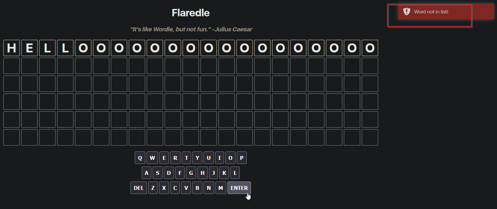

## Challenge Description
```text
Welcome to Flare-On 9
You probably won’t win. Maybe you’re like us and spent the year playing Wordle. We made our own version that is too hard to beat without cheating
Play it live at: http://flare-on.com/flaredle/
```
## Challenge Overview

Upon loading the website we are presented with some sort of Wordle game.


## Analysis of the Webapp.

When testing the app it seems that it only accepts words with a minimum length.


After some testing we can see that the length required is 21 characters, upon reaching the length the error message becomes "Word not in list!"


So we know that it checks a list of valid 21 character words.

## Source Inspection.

### words.js
Opening the Firefox devtools (Chrome's work too) and checking the Debugger tab we see that 2 javascript files are being loaded, script.js and words.js

words.js contains a list of valid words.


When trying a random word from the list the app now marks which letters are correct, which ones are present and which ones are not present in the correct answer.


Armed with that knowledge we can deduce that somewhere in the source code there's a comparison being made between our input word and the correct word.

### script.js

Examining script.js we find this interesting conditional statement in the code.
```javascript
...(SNIP)...

if (pressedKey === 'Enter') {
    checkGuess()
    return
  }

...(SNIP)...
```
Examining the function "checkGuess" we see that theres indeed a comparison being made between the variables "guessString" and  "rightGuessString"
```javascript
...(SNIP)...

if (guessString === rightGuessString) {
    let flag = rightGuessString + '@flare-on.com';
    toastr.options.timeOut = 0;
    toastr.options.onclick = function () {
      alert(flag);
    }
    toastr.success('You guessed right! The flag is ' + flag);
    guessesRemaining = 0
    return

...(SNIP)...
```

## Debugging

To quickly solve this challenge we can just set a breakpoint in the comparison and examine the contents of the variable "rightGuessString" at runtime.


Now that we know which word is the right answer we could run again the game and use the word to get the flag or we can be lazy and just use the console to change the value of the "guessString" variable as shown below.


Now we can resume the execution and the check will pass giving us the flag!


