## Challenge Description

```text
I said you wouldn’t win that last one. I lied. The last challenge was basically a captcha. Now the real work begins. Shall we play another game?
```

## Challenge Overview

A basic check shows us that we have a 32 bit Windows exe file.
```bash
remnux@remnux:~/flare/pixelPoker$ file PixelPoker.exe
PixelPoker.exe: PE32 executable (GUI) Intel 80386, for MS Windows
```
so let's switch to a Windows VM.
## Analysis of the Binary.

When we run the file we are presented with the following GUI.

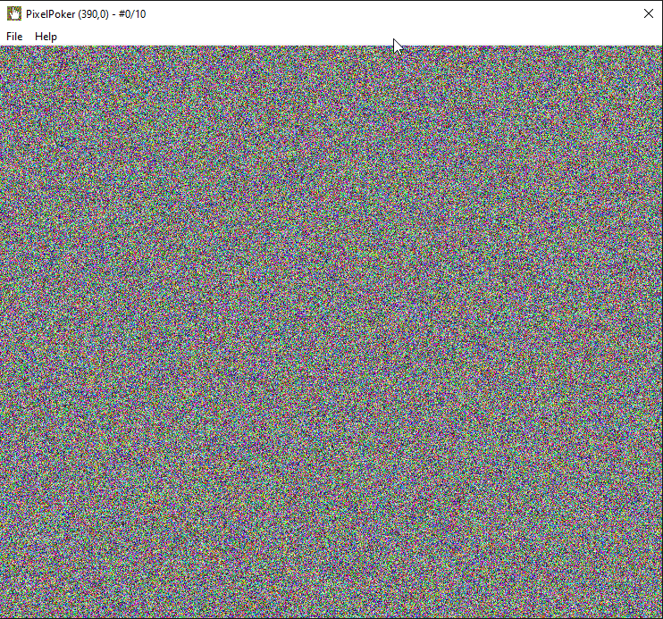

Playing around it seems that the goal is clicking the right pixel but we have only a limited amount of tries, the program tells us which coordinate we have clicked and how many tries left we have.
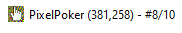

Upon failing we are presented with the following message box and after clicking "OK" the program closes.
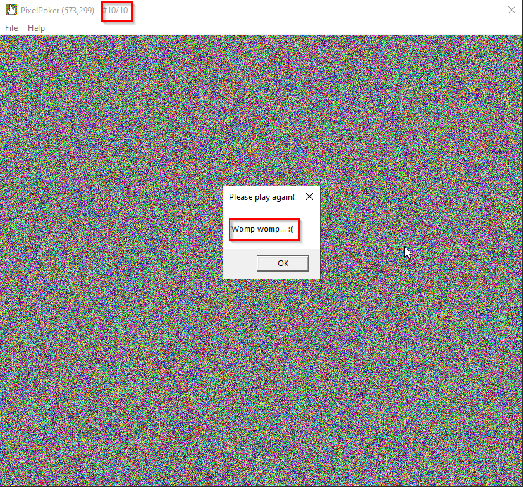

That gives us enough information on where to start looking for a solution.

## Reverse Engineering

We know that when we fail a message is presented to us by searching fot the strings in the program we can check it's references and find the function in which it is being used.
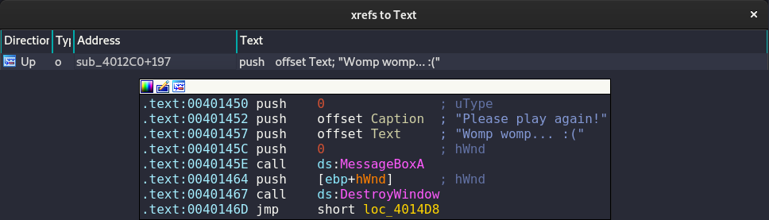

Next we can trace what triggers the creation of that message, we know that it happens when we reach 10 tries without guessing the right coordinates , that makes easier to identify where the comparison is being made.

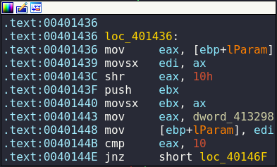

We can see in the image below that a comparison against 10 is being made, if it's equal (comp 10 10) it jumps to the creation of the failure message, if it's not 10 it jumps to another code block that makes a comparison, if that comparison passes it jumps to a block with yet another comparison.

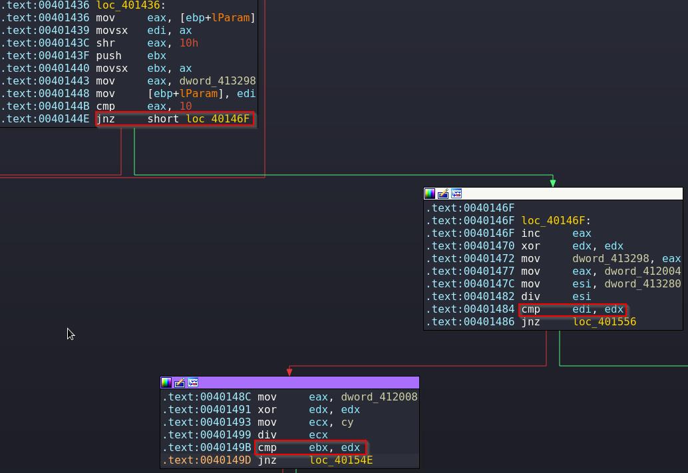

That makes sense taking into consideration that we are checking 2 coordinate values.

## Debugging

The most straight forward solution for this challenge (albeit not the only one nor the most refined) is to set breakpoints as shown below in the comparison instructions that we have previously identified.
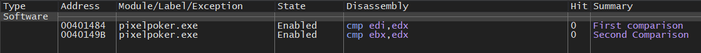

Next we run the program and when we click anywhere we hit immediately the first breakpoint where we can see that the registers EDI and EDX are being compared, we have the coordinates 143,22 and the values on EDI and EBX are 143 and 95 respectively, that means that our value is stored in EDI and the correct value (95) is stored in EDX.
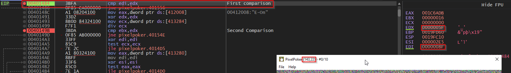
With that knowledge it's just as easy as changing the value of EDI to match EBX.

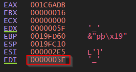

Then we continue the execution and it immediately hits the next breakpoint, this time it compares the registers EBX and EDX but we can do exactly the same that we did before and edit the value of EBX

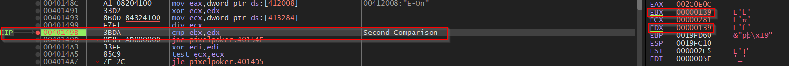

Now just resume the execution and we have our deserved flag!.
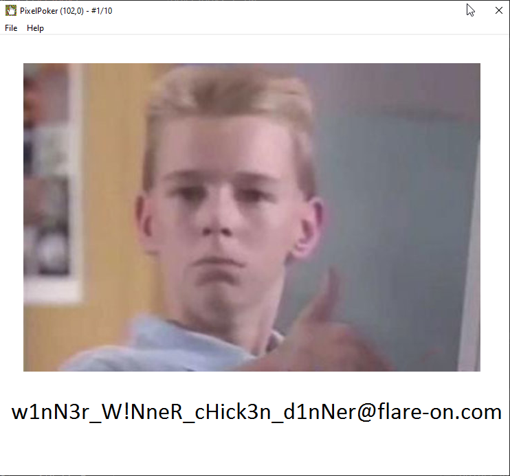

Lux-Sit