## Challenge Description
```text
You got a question? Ask the 8 ball!
```
## Basic Static Analysis

```bash
+------------------------+------------------------------------------------------------------------------------+
| md5                    | 3c2d4ea7b946596096bf039d0043a07b                                                   |
| sha1                   | ae41beb01a7caa07a5b6e847a7c04016539cba64                                           |
| sha256                 | 2fcead898d8f900715c9201f246d040eb9686b8f732e683518e8ef92d26dfa89                   |
| os                     | windows                                                                            |
| format                 | pe                                                                                 |
| arch                   | i386                                                                               |
| path                   | Magic8Ball.exe                                                                     |
+------------------------+------------------------------------------------------------------------------------+
```

We are given a Windows x32 exe and a bunch of DLLs and an assets directory.

```bash
remnux@remnux:~/flare/magic8$ file *
Magic8Ball.exe:  PE32 executable (GUI) Intel 80386, for MS Windows
libjpeg-9.dll:   PE32 executable (DLL) (console) Intel 80386 (stripped to external PDB), for MS Windows
libpng16-16.dll: PE32 executable (DLL) (console) Intel 80386 (stripped to external PDB), for MS Windows
libtiff-5.dll:   PE32 executable (DLL) (console) Intel 80386 (stripped to external PDB), for MS Windows
libwebp-7.dll:   PE32 executable (DLL) (console) Intel 80386 (stripped to external PDB), for MS Windows
SDL2.dll:        PE32 executable (DLL) (console) Intel 80386 (stripped to external PDB), for MS Windows
SDL2_image.dll:  PE32 executable (DLL) (GUI) Intel 80386 (stripped to external PDB), for MS Windows
SDL2_ttf.dll:    PE32 executable (DLL) (GUI) Intel 80386 (stripped to external PDB), for MS Windows
zlib1.dll:       PE32 executable (DLL) (console) Intel 80386 (stripped to external PDB), for MS Windows
assets:          directory
```

## Basic Dynamic Analysis

When executing the "Magic8Ball.exe" executable in a Windows VM we see this GUI.

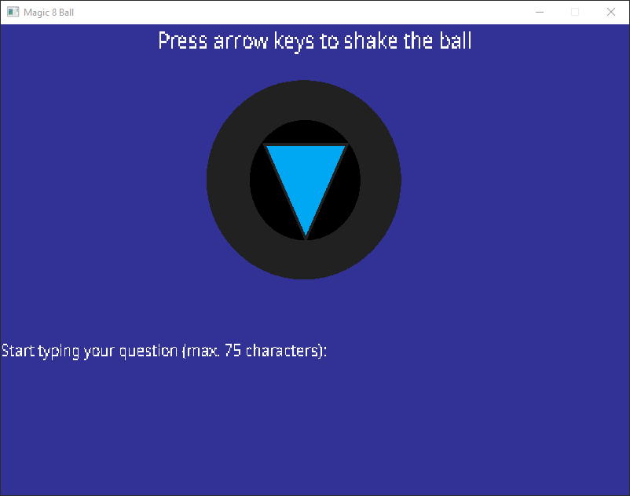

We can shake the ball using the arrow keys for what seems to be an unlimited amount of times and we can ask an arbitrary question.
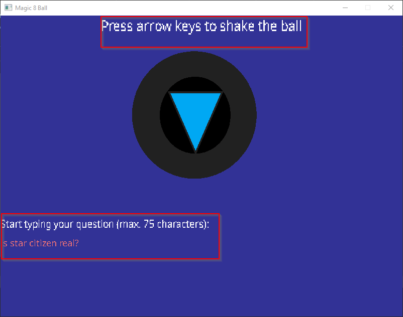

Then the ball answers us!
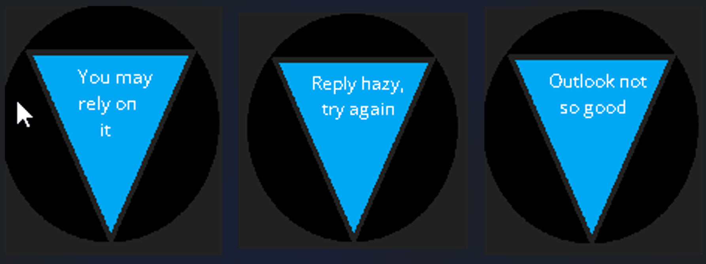

There seem to be multiple strings used to display answers, that gives us a starting point for reversing how the executable works.

## Advanced Static Analysis

We begin by searching for references to the strings used for the answers.

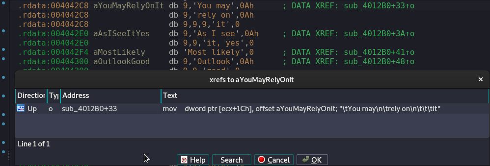

That leads us to this function which seems to initialize the strings used for answering.
```c
.text:004012B0 sub_4012B0 proc near
.text:004012B0
.text:004012B0 var_4= dword ptr -4
.text:004012B0
.text:004012B0 push    ebp
.text:004012B1 mov     ebp, esp
.text:004012B3 push    ecx
.text:004012B4 mov     [ebp+var_4], ecx
.text:004012B7 mov     dword ptr [ecx+4], 0
.text:004012BE mov     eax, ecx
.text:004012C0 mov     dword ptr [ecx+8], 0
.text:004012C7 mov     dword ptr [ecx+0Ch], offset aItIsCertain ; "\t\tIt is\n\tcertain"
.text:004012CE mov     dword ptr [ecx+10h], offset aItIsDecidedlyS ; "\t\tIt is\n\tdecidedly\n\t\t\tso"
.text:004012D5 mov     dword ptr [ecx+14h], offset aWithoutADoubt ; "Without a\n\t\tdoubt"
.text:004012DC mov     dword ptr [ecx+18h], offset aYesDefinitely ; "\t\tYes\n\tdefinitely"
.text:004012E3 mov     dword ptr [ecx+1Ch], offset aYouMayRelyOnIt ; "\tYou may\n\trely on\n\t\t\tit"
.text:004012EA mov     dword ptr [ecx+20h], offset aAsISeeItYes ; "\tAs I see\n\t\tit, yes"
.text:004012F1 mov     dword ptr [ecx+24h], offset aMostLikely ; "Most likely"
.text:004012F8 mov     dword ptr [ecx+28h], offset aOutlookGood ; "\tOutlook\n\t\tgood"
.text:004012FF mov     dword ptr [ecx+2Ch], offset aYes ; "\n\t\t\tYes"
.text:00401306 mov     dword ptr [ecx+30h], offset aSignsPointToYe ; "Signs point\n\t\tto yes"
.text:0040130D mov     dword ptr [ecx+34h], offset aReplyHazyTryAg ; "Reply hazy,\n\ttry again"
.text:00401314 mov     dword ptr [ecx+38h], offset aAskAgainLater ; "Ask again\n\t\tlater"
.text:0040131B mov     dword ptr [ecx+3Ch], offset aBetterNotTellY ; "Better not\n\ttell you\n\t\tnow"
.text:00401322 mov     dword ptr [ecx+40h], offset aCannotPredictN ; "\tCannot\t\n\tpredict\n\t\tnow"
.text:00401329 mov     dword ptr [ecx+44h], offset aConcentrateAnd ; "Concentrate\n\tand ask\n\t\tagain"
.text:00401330 mov     dword ptr [ecx+48h], offset aDonTCountOnIt ; "Don't count\n\t\ton it"
.text:00401337 mov     dword ptr [ecx+4Ch], offset aMyReplyIsNo ; "My reply is\n\t\t\tno"
.text:0040133E mov     dword ptr [ecx+50h], offset aMySourcesSayNo ; "My sources\n\t\t\tsay\n\t\t\tno"
.text:00401345 mov     dword ptr [ecx+54h], offset aOutlookNotSoGo ; "Outlook not\n\tso good"
.text:0040134C mov     dword ptr [ecx+58h], offset aVeryDoubtful ; "\t\tVery\n\tdoubtful"
.text:00401353 mov     dword ptr [ecx+0E0h], 0
.text:0040135D mov     dword ptr [ecx+0F0h], 0
.text:00401367 mov     dword ptr [ecx+0F4h], 0Fh
.text:00401371 mov     byte ptr [ecx+0E0h], 0
.text:00401378 mov     dword ptr [ecx+0F8h], 0
.text:00401382 mov     dword ptr [ecx+108h], 0
.text:0040138C mov     dword ptr [ecx+10Ch], 0Fh
.text:00401396 mov     byte ptr [ecx+0F8h], 0
.text:0040139D mov     dword ptr [ecx+110h], 0
.text:004013A7 mov     dword ptr [ecx+120h], 0
.text:004013B1 mov     dword ptr [ecx+124h], 0Fh
.text:004013BB mov     byte ptr [ecx+110h], 0
.text:004013C2 mov     dword ptr [ecx+128h], 0
.text:004013CC mov     dword ptr [ecx+138h], 0
.text:004013D6 mov     dword ptr [ecx+13Ch], 0Fh
.text:004013E0 mov     byte ptr [ecx+128h], 0
.text:004013E7 mov     dword ptr [ecx+140h], 0
.text:004013F1 mov     dword ptr [ecx+150h], 0
.text:004013FB mov     dword ptr [ecx+154h], 0Fh
.text:00401405 mov     byte ptr [ecx+140h], 0
.text:0040140C mov     esp, ebp
.text:0040140E pop     ebp
.text:0040140F retn
.text:0040140F sub_4012B0 endp
```
We rename the function to "answers_init".

We could now trace which function calls "answers_init" and examine function per function how everything works but let's be lazier and check the important imports first.

### Simple DirectMedia Layer Imports

Since the executable id built using SDL (Simple DirectMedia Layer) and we know that the executable creates a window and accepts inputs from the user some interesting functions to examine would be the ones that call SDL_CreateWindow, SDL_PollEvent and SDL_StartTextInput.

#### SDL_CreateWindow

Using references we can find out where SDL_CreateWindow is called.
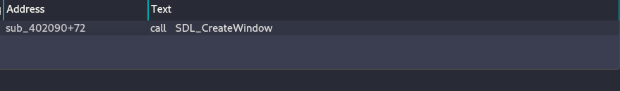

By looking at the calls that the function makes we can see that it loads assets, renders text in the window etc.. but it also initializes a structure that contains some suspicious hex values.

```bash
.text:004021A1 mov     dword ptr [edi+5Ch], 6D6D6967h
.text:004021A8 mov     dword ptr [edi+60h], 6C662065h
.text:004021AF mov     dword ptr [edi+64h], 70206761h
.text:004021B6 mov     dword ptr [edi+68h], 3F736Ch
```

Hex values beginning with 3, 4, 5, 6, or 7 are ASCII characters, after converting that mysterious hex values and swapping the endianness we end up with the string:

```bash
'gimme flag pls?'
```

We can assume that that is the question that we must ask to get the flag but when trying it it won't give anything but a generic answer, so we must keep on reversing.

#### SDL_PollEvent

Using the same method we can find the function that calls **SDL_PollEvent** labeled as **"sub_401E50"**.

This function sets some flags according to the user input that it receives so we can rename it as **"keyboard"**, if we examine how the data that this function sets is used maybe we can get the answers that we are seeking.

Following that line of thought the function that we should inspect is **"sub_4924E0"**.
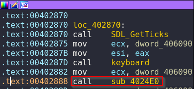

One thing to notice on the image above is that data is being copied into ecx can be traced to the string:

```bash
gimme flag pls?
```
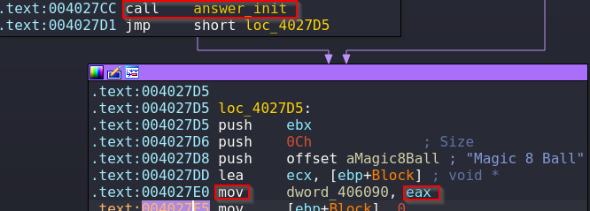

#### Which Direction?

The function contains a lot of if statements checking for strings.

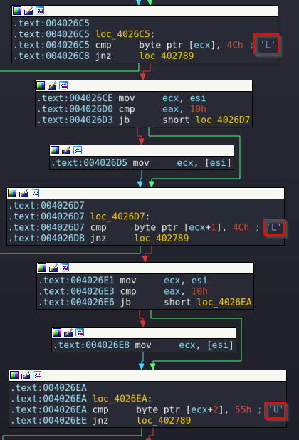

if we join all the comparisons we end up with the string 
```bash
'LLURULDU'
```
We can guess that L means left, U up etc... 

There's also a a call to strncmp which probably checks if the question that we inputted is the correct one.
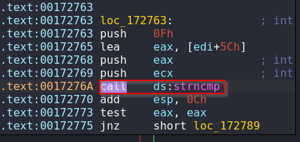

To quickly test this we can open the executable in x32dbg and quickly test it.

## Advanced Dynamic Analysis

After rebasing the executable in Ida in order to set the breakpoint in the debugger, running the program, inputting the directions up x2, down x2, right x2 and  left x2 and entering the string **'hello'** as question we hit the breakpoint.

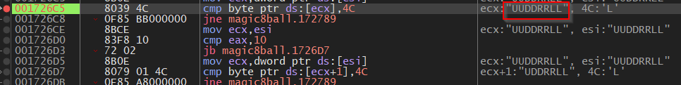

We can confirm that the letters symbolize the directions, let's check the contents of the offsets being compared.

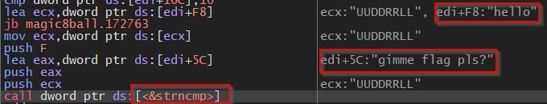

That also confirms that our input is being compared with 'gimme flag pls?'.

## Flag
Now that we now what to input let's start again the executable and input the directions "LLURULDU" and the question "gimme flag pls?"

And it works! we have the flag.

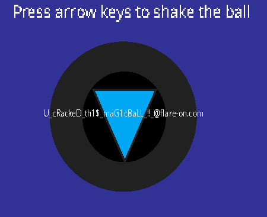