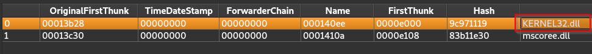
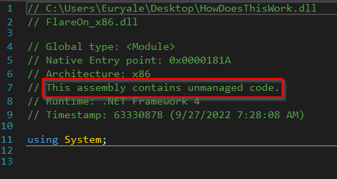
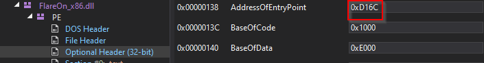
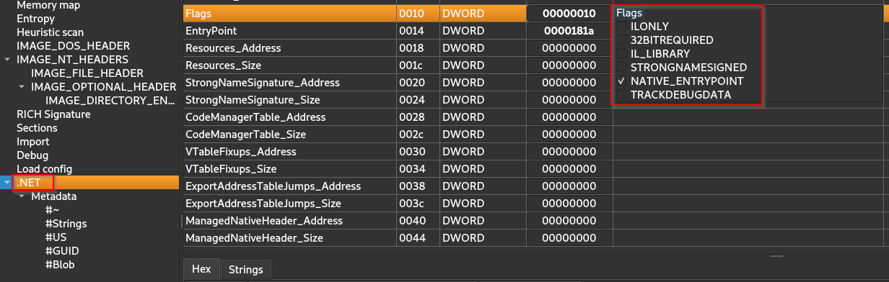
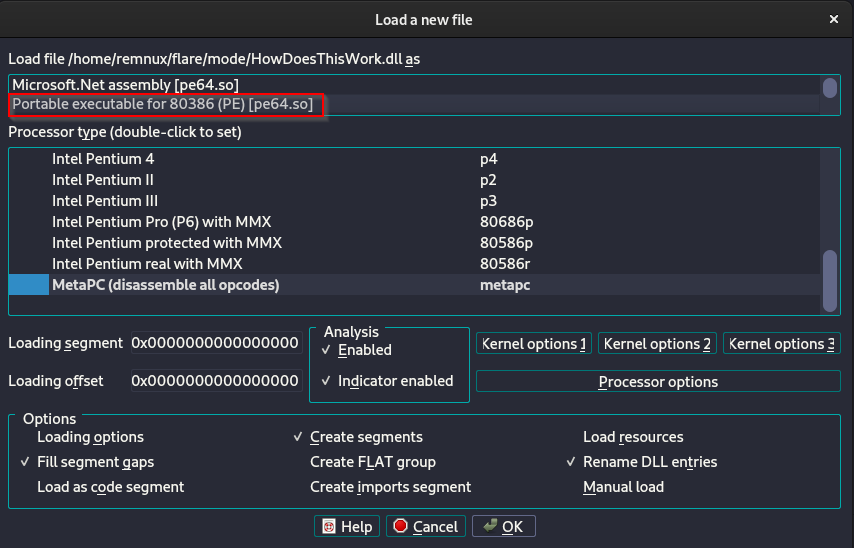
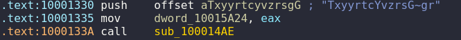
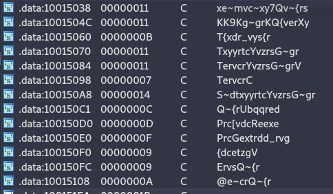
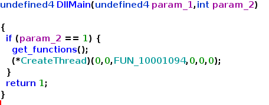
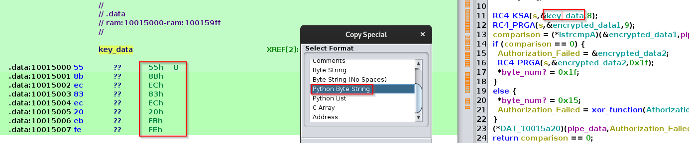

## Challenge Description

```text
FLARE FACT #824: Disregard flare fact #823 if you are a .NET Reverser too.
We will now reward your fantastic effort with a small binary challenge. You’ve earned it kid!
```

## Basic Static Analysis

We are given what appears to be a .Net Dll and a chat log
```bash
file *
HowDoesThisWork.dll: PE32 executable (DLL) (GUI) Intel 80386 Mono/.Net assembly, for MS Windows
IR chat log.txt:     ASCII text, with CRLF line terminators
```
The Dll seems to be missing the executable that is supposed to interact with it according to the text file.
```bash
cat 'IR chat log.txt'
[FLARE Team]  Hey IR Team, it looks like this sample has some other binary that might 
              interact with it, do you have any other files that might be of help.			
[IR Team]     Nope, sorry this is all we got from the client, let us know what you got.
```

### Imports

Looking at the imports we see something quite interesting.



In a .NET assembly the only import that we should see is **mscoree.dll** in our case **kernel32.dll** is also imported that is a sign of [mixed-mode](https://learn.microsoft.com/en-us/cpp/dotnet/mixed-native-and-managed-assemblies?view=msvc-170).

### Headers

Loading the Dll in **dnSpy** confirms our suspicion of mixed-mode being present.



If we examine the optional header we see that it defines an **AddressOfEntryPoint**.



That address will load the **DllEntryPoint** which immediately calls **CorDllMain**, but we are interested in reaching the unmanaged code, by checking the **COR20** we can get the address of the entry point that leads to the unmanaged code.


## Advanced Static Analysis

### Managed Code.

When loading the Dll in **dnSpy** and analyze it's functionality we can immediately see the following:

- An empty constructor.
```cs
// FlareOn.Flag
// Token: 0x06000002 RID: 2 RVA: 0x0000D158 File Offset: 0x0000C558
public Flag()
{
}
```
- A method containing a function named GetFlag that takes a string labeled **password**.
```cs
// FlareOn.Flag
// Token: 0x06000001 RID: 1 RVA: 0x0000D078 File Offset: 0x0000C478
public string GetFlag(string password)
{
	Decoder decoder = Encoding.UTF8.GetDecoder();
	UTF8Encoding utf8Encoding = new UTF8Encoding();
	string text = "";
	byte[] array = new byte[64];
	char[] array2 = new char[64];
	byte[] bytes = utf8Encoding.GetBytes(password + "\0");
	using (NamedPipeClientStream namedPipeClientStream = new NamedPipeClientStream(".", "FlareOn", PipeDirection.InOut))
	{
		namedPipeClientStream.Connect();
		namedPipeClientStream.ReadMode = PipeTransmissionMode.Message;
		namedPipeClientStream.Write(bytes, 0, Math.Min(bytes.Length, 64));
		int byteCount = namedPipeClientStream.Read(array, 0, array.Length);
		int chars = decoder.GetChars(array, 0, byteCount, array2, 0);
		text += new string(array2, 0, chars);
	}
	return text;
}
```
The manage code is taking the string parameter **password** and writing it to a pipe then it reads back a response and returns it.


### Unmanaged Code

We now know what the managed code does but the meat of the challenge lies in the unmanaged code so let's analyze it by loading it into **Ida**.

Note: to correctly analyze the unmanaged code we must choose "Portable executable for 80386(PE) [pe64.so]"


Once loaded we can jump to the entry point that we found when inspecting the **COR20** header (offset **0x181A**, VA would be **0x1000181A**)

The code isn't recognized as a function so we need to select it and press "p" to fix that, that will leave us in the function **__DllMainCRTStartup**, from there we can navigate following the calls to **dllmain_dispatch** where we will find function **0x10001163** which we can rename to **DllMain**.

#### Suspicious Strings

Dll main First calls a function **sub_100012F1** this function passes a lot of sus strings to another function labeled **sub_100014AE**.



Which based on our analysis **xors** the sus strings with **0x17**.

```asm
.text:100014C4 xor     al, 17h
```

Let's find all the sus strings and try to decode them to see what they really are.


NOTE: for some reason letter "h" is not correctly displayed but that's quickly inferred and thus has been fixed bellow.
```text
Vbc',7Fh,'xe~mvc~xy7Qv~{rs - Authorization Failed.
KK9Kg~grKQ{verXy - \\.\pipe\FlareOn
T{xdr_vys{r - CloseHandle
TxyyrtcYvzrsG~gr - ConnectNamedPipe
TervcrYvzrsG~grV - CreateNamedPipeA
TervcrC',7Fh,'ervs - CreateThread
S~dtxyyrtcYvzrsG~gr - DisconnectNamedPipe
Q~{rUbqqred - FileBuffers
Prc[vdcReexe - GetLastError
PrcGextrdd_rvg - GetProcessHeap
{dcetzgV - lstrcmpA
ErvsQ~{r - ReadFile
@e~crQ~{r - WriteFile
```

We can conclude that function **sub_100012F1** is a dynamic API resolver.

This simplifies the analysis of the executable as we can know rename the sus strings giving us a much clearer picture as the image below of **DllMain** shows. 



####  Create Thread

The function used in the call to Create Thread (**FUN_10001094**) connects to a pipe, reads data from the pipe and then passes that date to function **FUN_10001000** and then it writes back to the pipe.

```c
  pipe_name = xor_function(\\.\pipe\FlareOn,&DAT_100159d8);
  pipe_name = (*CreateNamedPipeA)(pipe_name,dwOpenMode,dwPipeMode,nMaxInstances,nOutBuffe rSize,nInBufferSize,nDefaultTimeOut,lpSecurityAttributes);
  if (pipe_name != -1) {
    pipe_handle = (*ConnectNamedPipe)(pipe_name,0);
    if (pipe_handle == 0) {
      (*GetLastError)();
    }
    pipe_handle = (*ReadFile)(pipe_name,lpBuffer,0x40,&lpNumberOfBytesRead,0);
    if ((pipe_handle == 0) || (lpNumberOfBytesRead == 0)) {
      (*GetLastError)();
    }
    else {
      (*CreateThread)(pipe_name);
      lpBuffer[lpNumberOfBytesRead] = 0;
                    /* lpBuffer has recv data */
      FUN_10001000(lpBuffer,&nNumberOfBytesToWrite);
      (*WriteFile)(pipe_name,lpBuffer,nNumberOfBytesToWrite,lpNumberOfBytesWritten,0);
    }
    (*CreateThread)(pipe_name);
    (*DisconnectNamedPipe)(pipe_name);
    (*CloseHandle)(pipe_name);
  }
  return 0;
}
```
We can guess that function **FUN_10001000** probably makes some sort of check so let's analyze it.

#### RC4

After analyzing the calls that this function makes turns out that **FUN_100011ef** is an RC4 KSA function given the indicators in the assembly code.

([This](https://www.goggleheadedhacker.com/blog/post/reversing-crypto-functions#rc4-algorithm) is a really good post to identify this type of functions by just analyzing the disassembly.)

That means that the function **FUN_10001187** must be the RC4 PRGA function.

Now we can rename everything accordingly and we end up with the following code.

```c
{
  ...(SNIP)...
  RC4_KSA(s,&key_data,8);
  RC4_PRGA(s,&encrypted_data1,9);
  comparison = (*lstrcmpA)(&encrypted_data1,pipe_data);
  if (comparison == 0) {
    Authorization_Failed = &encrypted_data2;
    RC4_PRGA(s,&encrypted_data2,0x1f);
    *byte_num? = 0x1f;
  }
  else {
    *byte_num? = 0x15;
    Authorization_Failed = xor_function(AthorizationFailed,&DAT_100159d8);
  }
  (*DAT_10015a20)(pipe_data,Authorization_Failed);
  return comparison == 0;
}
```
We see that the data received through the pipe is being validated using **lstrcmpA** against a RC4 encrypted string which we could decrypt if we extract the key.
## Flag

We can extract the Flag using 2 methods.
### Method 1 - Create .Net console app

As hinted in the in the log file an executable used to interact with the Dll is missing so let's create it.
#### Extract Password

First we need to extract the key from the **RC4 KSA** function and the encrypted data from **RC4 PRGA** 



With both extracted we can create a python script that decrypts the data used in the RC4 PRGA.
```python
from Crypto.Cipher import ARC4

key = b'\x55\x8B\xEC\x83\xEC\x20\xEB\xFE'

encrypted_data1 = b'\x3e\x39\x51\xfb\xa2\x11\xf7\xb9\x2c'

cipher = ARC4.new(key)
print('Encrypted Data 1: {}'.format(cipher.decrypt(encrypted_data1).decode()))
```
Success!
```bash
Encrypted Data 1: 'MyV0ic3!'
```

#### Create Console App

Now we can create a ***.Net C# Console Application*** using ***Visual Studio***.
```cs
using System;
using FlareOn;
namespace FlareOn_app
{
	class Program
	{
		static void Main()
		{
			Console.WriteLine("Got it!: {0}", new Flag().GetFlag("MyV0ic3!"));
		}
	}
}
```
We must add the DLL as a reference and also rename it to "**FlareOn_x86.dll**".

Now we run it and hope that it works.
```powershell
Directory of C:\Users\Euryale\Desktop\Solution

09/27/2022  06:28 AM            78,848 FlareOn_x86.dll
11/26/2022  02:46 PM             4,608 solver.exe
               2 File(s)         83,456 bytes

C:\Users\Euryale\Desktop\Solution> solver.exe

"Got it!: M1x3d_M0dE_4_l1f3@flare-on.com"
```
Voila! We have the flag.
### Method 2 - Pure Python

Upon further analyzing the algorithm the challenge can also be solved without creating the .Net C# console app hassle (albeit it's more fun than just using python).

if the comparison between the RC4 decrypted data and the received data from the pipe succeeds another decryption using the same key takes place:

```c
  comparison = (*lstrcmpA)(&encrypted_data1,pipe_data);
  if (comparison == 0) {
    Authorization_Failed = &encrypted_data2;
    RC4_PRGA(local_40c,&encrypted_data2,0x1f);
    *byte_num? = 0x1f;
  }
```

If we add that data to our script:

```python
from Crypto.Cipher import ARC4

key = b'\x55\x8B\xEC\x83\xEC\x20\xEB\xFE'

encrypted_data1 = b'\x3e\x39\x51\xfb\xa2\x11\xf7\xb9\x2c'
encrypted_data2 = b'\xe1\x60\xa1\x18\x93\x2e\x96\xad\x73\xbb\x4a\x92\xde\x18\x0a\xaa\x41\x74\xad\xc0\x1d\x9f\x3f\x19\xff\x2b\x02\xdb\xd1\xcd\x1a'

cipher = ARC4.new(key)
print('Encrypted Data 1: {}'.format(cipher.decrypt(encrypted_data1).decode()))
print('Encrypted Data 2: {}'.format(cipher.decrypt(encrypted_data2).decode()))
```
We can also get the flag in this way.

```bash
Encrypted Data 1: MyV0ic3!
Encrypted Data 2: M1x3d_M0dE_4_l1f3@flare-on.com
```
Lux-Sit