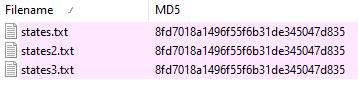

## Challenge Description

```text
You’ve made it so far! I can’t believe it! And so many people are ahead of you!
```

## Basic Static Analysis

We are given a Windows 64-bit executable.
```bash
> file *
anode.exe: PE32+ executable (console) x86-64, for MS Windows
```

If we check the file description we can see that we are dealing with a [javascript](https://www.youtube.com/watch?v=aXOChLn5ZdQ) file.
```bash
description,Node.js: Server-side JavaScript
```

It's a huge executable.
```bash
> ls -lsh anode.exe 
55M -rw-rw-r-- 1 remnux remnux 55M Sep 26 08:08 anode.exe
```
### Strings

When checking for strings it stood out that what seems to be the script code is clearly in a readable format as shown in the extract below.
```js
...(SNIP)...

    break;
  var target = [106, 196, 106, 178, 174, 102, 31, 91, 66, 255, 86, 196, 74, 139, 219, 166, 106, 4, 211, 68, 227, 72, 156, 38, 239, 153, 223, 225, 73, 171, 51, 4, 234, 50, 207, 82, 18, 111, 180, 212, 81, 189, 73>
  if (b.every((x,i) => x === target[i])) {
    console.log('Congrats!');
  } else {
    console.log('Try again.');

...(SNIP)...
```
We also can see a very interesting footer.
```text
<nexe~~sentinel>
```

## Dynamic Analysis

When executing it gives us a prompt asking for a flag.
```cmd
Enter flag: give_flag_plos!
Try again.
```
After testing different inputs it always prints the same message.

## Advanced Static Analysis

Based on the information that we have we should now move to try to see what's going on under the hood.

### Unpacking

Upon some googling on what's "**nexe**" we find it's [github repository](https://github.com/nexe/nexe) and the description states:

```bash
Nexe is a command-line utility that compiles your Node.js application into a single executable file.
```

It seems that **nexe** embeds the code in the built binary and it's possible to extract it even with a hex editor as we guessed when looking at the strings output, but before getting out hands dirty manually unpacking a quick google search shows that there is already an [unpacker](https://www.npmjs.com/package/nexe_unpacker) for nexe.

After following the instructions we now have the unpacked javascript code.

```bash
> cat anode.exe | nexe_unpacker --stdin --out extracted
> ls
anode.exe  extracted
> cd extracted/
> ls
anode.js
> cat anode.js 
const readline = require('readline').createInterface({
  input: process.stdin,
  output: process.stdout,
});

...(SNIP)...
```

### Code Analysis

The code first checks if the input is **44 characters long** if not it just prints what we saw when testing, if the input is 44 characters long it will then convert each character into "an integer between 0 and 65535 representing the UTF-16 code unit at the given index."

```javascript
const readline = require('readline').createInterface({
  input: process.stdin,
  output: process.stdout,
});

readline.question(`Enter flag: `, flag => {
  readline.close();
  if (flag.length !== 44) {
    console.log("Try again.");
    process.exit(0);
  }
  var b = [];
  for (var i = 0; i < flag.length; i++) {
    b.push(flag.charCodeAt(i));
  }
```

Thn there  seems to be something strange happening here according to the comment that was already present in the code we will test what's strange when performing the dynamic analysis but even now we can tell it's strange because the condition should always be true and thus the flow of the program should always stop here.
```js
  // something strange is happening...
  if (1n) {
    console.log("uh-oh, math is too correct...");
    process.exit(0);
  }
```

Then theres what seems to be a [state machine](https://barrgroup.com/embedded-systems/how-to/coding-state-machines).

There are **1025 cases** in the switch + the default case
```bash
grep -o  -i "case" extracted.js | wc -l
1025
```

The if statements in every switch case seem to branch out depending on a **random value** or a **bigint** number as shown below in two example cases and in each case the functionality seems to be changing the value of a byte of the input.
```js
  var state = 1337;
  while (true) {
    state ^= Math.floor(Math.random() * (2**30));
    switch (state) {
      case 306211:
        if (Math.random() < 0.5) {
          b[30] -= b[34] + b[23] + b[5] + b[37] + b[33] + b[12] + Math.floor(Math.random() * 256);
          b[30] &= 0xFF;
        } else {
          b[26] -= b[24] + b[41] + b[13] + b[43] + b[6] + b[30] + 225;
          b[26] &= 0xFF;
        }
        state = 868071080;
        continue;

...(SNIP)...

        continue;
      case 755154:
        if (93909087n) {
          b[4] -= b[42] + b[6] + b[26] + b[39] + b[35] + b[16] + 80;
          b[4] &= 0xFF;
        } else {
          b[16] += b[36] + b[2] + b[29] + b[10] + b[12] + b[18] + 202;
          b[16] &= 0xFF;
        }
        state = 857247560;
        continue;

...(SNIP)...
```

The last part of the code seems to check the final result of the permutations made in the state machine against an array and printing a message according to the comparison's result.
```js
  var target = [106, 196, 106, 178, 174, 102, 31, 91, 66, 255, 86, 196, 74, 139, 219, 166, 106, 4, 211, 68, 227, 72, 156, 38, 239, 153, 223, 225, 73, 171, 51, 4, 234, 50, 207, 82, 18, 111, 180, 212, 81, 189, 73, 76];
  if (b.every((x,i) => x === target[i])) {
    console.log('Congrats!');
  } else {
    console.log('Try again.');
  }
});
```

## Advanced Dynamic Analysis

When testing both executables with the expected length of input (**44**) there is a difference in behavior between the original executable and out unpacked version.
```bash
# Original executable
> anode.exe
Enter flag: AAAAAAAAAAAAAAAAAAAAAAAAAAAAAAAAAAAAAAAAAAAA
Try again.

# Unpacked version.
> node extracted.js
Enter flag: AAAAAAAAAAAAAAAAAAAAAAAAAAAAAAAAAAAAAAAAAAAA
uh-oh, math is too correct...
```

The behavior of the unpacked **extracted.js** should be the correct one because of the check that's being made in the code:
```js
// something strange is happening...
  if (1n) {
    console.log("uh-oh, math is too correct...");
    process.exit(0);
  }
```
**1n** should **always be true** as the value is **1** (1 == true) but the check in the original executable is yielding **false** that leads us to believe that there's some type of tampering taking place.

If we patch that line in **extracted.js** we get the following behavior:

```bash
> node extracted_patched.js 
Enter flag: AAAAAAAAAAAAAAAAAAAAAAAAAAAAAAAAAAAAAAAAAAAA
uh-oh, math.random() is too random...
```

The message now complains that math.random() is ... too ... random... that also tells us that **Math.random()** is algo tampered in the compiled version, that makes sense as the flag is always the same so the states can't be random.

We can conclude that there's some **tampering** occurring with **Math.random()** and **bigint** in the original executable.

### Patching

Before reversing the whole node package to see what's being tampered we will test if the executable can be patched to give us the information that we want without that hassle.


It works.
```bash
> "anode - Copy.exe"
Enter flag: hello
LOL NOPE..
```

Now we will extract the states that are being used to select the switch cases, it's important to keep the same length in the executable by removing the same amount of bytes that you add if not it will crash.


After running multiple times we can conclude that **Math.random()** indeed produces the same results every time.



Now we need to see how it branches out to understand how the bytes of the input are being processed.


Notice how it's also [masking](https://oscarliang.com/what-s-the-use-of-and-0xff-in-programming-c-plus-p/) every byte so that it remains a value of 8 bits.
```js
b[30] &= 0xFF;
```

After testing it correctly displays the operations that it makes in a case branch.
```bash
> echo AAAAAAAAAAAAAAAAAAAAAAAAAAAAAAAAAAAAAAAAAAA | "anode - Copy.exe"
Enter flag: AAAAAAAAAAAAAAAAAAAAAAAAAAAAAAAAAAAAAAAAAAA
b[30] -= b[34] + b[23] + b[5] + b[37] + b[33] + b[12] + 60
Try again.
```

## Extracting all Operations

Now we must do the same for all **1025** cases for that we will need to make a lot of space , a great strategy for that is getting rid of the leading spaces as shown in the picture (all the light blue are bytes that we can free)


With that in mind we can wrap the branches with **console.log()** and extract the operations performed and after applying the changes let's test it and dump the output into a text file.
```bash
> echo AAAAAAAAAAAAAAAAAAAAAAAAAAAAAAAAAAAAAAAAAAA | "operations.exe" > operations.txt
```

We have extracted all the operations that the executable performs through the state machine.
```text
b[29] -= b[37] + b[23] + b[22] + b[24] + b[26] + b[10] + 7
b[29] &= 0xFF
b[39] += b[34] + b[2] + b[1] + b[43] + b[20] + b[9] + 79
b[39] &= 0xFF
b[19] ^= (b[26] + b[0] + b[40] + b[37] + b[23] + b[32] + 255) & 0xFF
b[28] ^= (b[1] + b[23] + b[37] + b[31] + b[43] + b[42] + 245) & 0xFF
b[39] += b[42] + b[10] + b[3] + b[41] + b[14] + b[26] + 177
b[39] &= 0xFF
b[9] -= b[20] + b[19] + b[22] + b[5] + b[32] + b[35] + 151
b[9] &= 0xFF
```

## Reversing the operations

Now that we have extracted the operations we need to **reverse the order**, that means starting from bottom to top.

```bash
# Reverse the order of the file using bash.
❯ tac operations.txt > reversed_ops.txt
```
Now we open the files in **nvim** and perform the following operations to move all the lone maskings on line down.
```bash
# Move the one line maskings down a line.
:g/.*&=.*/norm ddjp

b[39] += b[18] + b[16] + b[8] + b[19] + b[5] + b[23] + 36
b[39] &= 0xFF

# Append ; at the end of each line.
g/$/norm A;
```
Last step is inverting the signs of the operations (**+= becomes -=**) and the end result should look like bellow.
```js
b[39] -= b[18] + b[16] + b[8] + b[19] + b[5] + b[23] + 36;
b[39] &= 0xFF;
b[22] -= b[16] + b[18] + b[7] + b[23] + b[1] + b[27] + 50;
b[22] &= 0xFF;
b[34] -= b[35] + b[40] + b[13] + b[41] + b[23] + b[25] + 14;
b[34] &= 0xFF;
```
## Flag

We will use javascript to reverse everything including the transformation to unicode that the program did using.
```js
// Convert input into Unicode
var b = [];
  for (var i = 0; i < flag.length; i++) {
    b.push(flag.charCodeAt(i));
  }
```

That results in the following script.
```js
// Flag Unicode
let b = [106, 196, 106, 178, 174, 102, 31, 91, 66, 255, 86, 196, 74, 139, 219, 166, 106, 4, 211, 68, 227, 72, 156, 38, 239, 153, 223, 225, 73, 171, 51, 4, 234, 50, 207, 82, 18, 111, 180, 212, 81, 189, 73, 76];

// Reversed Operations
b[39] -= b[18] + b[16] + b[8] + b[19] + b[5] + b[23] + 36;
b[39] &= 0xFF;
...(SNIP)...

// Convert flag from Unicode.
let result = "";
for (let i = 0; i < b.length; i++) {
    result += String.fromCharCode(b[i])
}

console.log(result);
```

And it worked!:
```bash
> node solve.js 
n0t_ju5t_A_j4vaSCriP7_ch4l1eng3@flare-on.com
```

Lux-Sit