## Challenge Description
```text
FLARE FACT #823: Studies show that C++ Reversers have fewer friends on average than normal people do. That’s why you’re here, reversing this, instead of with them, because they don’t exist.

We’ve found an unknown executable on one of our hosts. The file has been there for a while, but our networking logs only show suspicious traffic on one day. Can you tell us what happened?
```
## Challenge Overview

We are given a Windows PE32 executable.

```bash
+------------------------+------------------------------------------------------------------------------------+
| md5                    | ece22f965b73135469a29a15ae978fb8                                                   |
| sha1                   | 2fd7acefe6c1d258a5666f2b33e123af2eecab50                                           |
| sha256                 | 892a46d456d3ac2d4b406728b0b15dc40450c03bc40af03fd3c510f52eb6f3f7                   |
| os                     | windows                                                                            |
| format                 | pe                                                                                 |
| arch                   | i386                                                                               |
| path                   | t8.exe                                                                             |
+------------------------+------------------------------------------------------------------------------------+
```
And a .pcap file.
```bash
traffic.pcapng: pcapng capture file - version 1.0
```
## Basic Analysis.

### Functionality
We can use capa to get a quick overview of the executable's capabilities.
```bash
+------------------------------------------------------+------------------------------------------------------+
| CAPABILITY                                           | NAMESPACE                                            |
|------------------------------------------------------+------------------------------------------------------|
| get geographical location                            | collection                                           |
| initialize WinHTTP library                           | communication/http                                   |
| prepare HTTP request                                 | communication/http/client                            |
| receive HTTP response                                | communication/http/client                            |
| encode data using Base64 (2 matches)                 | data-manipulation/encoding/base64                    |
| reference Base64 string                              | data-manipulation/encoding/base64                    |
| encode data using XOR                                | data-manipulation/encoding/xor                       |
| encrypt data using RC4 KSA                           | data-manipulation/encryption/rc4                     |
| encrypt data using RC4 PRGA                          | data-manipulation/encryption/rc4                     |
| hash data with MD5                                   | data-manipulation/hashing/md5                        |
| contain a resource (.rsrc) section                   | executable/pe/section/rsrc                           |
| print debug messages (2 matches)                     | host-interaction/log/debug/write-event               |
| allocate RWX memory                                  | host-interaction/process/inject                      |
+------------------------------------------------------+------------------------------------------------------+
```
That gives us a quick overview of the executable's functionality which includes communication, encoding and encryption.

### Imports

Looking at the imports we see potential anti-debugging techniques among other interesting functions that give us a bigger picture of the functionality of the exe.
```bash
KERNEL32.dll - Sleep
KERNEL32.dll - OutputDebugStringW   # Can be used as an anti-debugging technique.
KERNEL32.dll - CreateFileW
KERNEL32.dll - GetModuleHandleW   # Can be used to locate and modify code in a loaded module.
KERNEL32.dll - GetProcAddress   # Retrieves the address of a function in a DLL loaded into memory.
KERNEL32.dll - IsDebuggerPresent  # Can be used as an anti-debugging technique but often added by the compiler.
KERNEL32.dll - GetStartupInfoW  # Retrieves a structure containing details about how the current process was configured to run.
KERNEL32.dll - QueryPerformanceCounter  # Can be used as an anti-debugging technique.
KERNEL32.dll - LoadLibraryExW   # Dynamically loads a DLL.
KERNEL32.dll - WriteFile
KERNEL32.dll - FindFirstFileExW   # Searches through a directory.
KERNEL32.dll - FindNextFileW   # Searches through a directory.
```
And we can confirm what capa already showed us, that the malware imports libraries needed for communication vie http.
```text
WINHTTP.dll - WinHttpReceiveResponse
WINHTTP.dll - WinHttpOpen
WINHTTP.dll - WinHttpReadData
WINHTTP.dll - WinHttpOpenRequest
WINHTTP.dll - WinHttpCloseHandle
WINHTTP.dll - WinHttpSendRequest
WINHTTP.dll - WinHttpConnect

urlmon.dll  - ObtainUserAgentString - Retrieves the User-Agent HTTP request header string that is currently being used.
```

### Strings

Using Floss we find a few interesting strings.
```bash
# Standard Base64 string
ABCDEFGHIJKLMNOPQRSTUVWXYZabcdefghijklmnopqrstuvwxyz0123456789+/
ABCDEFGHIJKLMNOPQRSTUVWXYZabcdefghijklmnopqrstuvwxyz0123456789-_
Input is not valid base64-encoded data.

# Lot's of mangled function names typical of C++ code.
.?AVCClientSock@@

# A domain name.
flare-on.com
```

### Pcap File.

The pcap file contains two HTTP Post Requests with their respective responses which contain what seems to be a b64 encoded body.

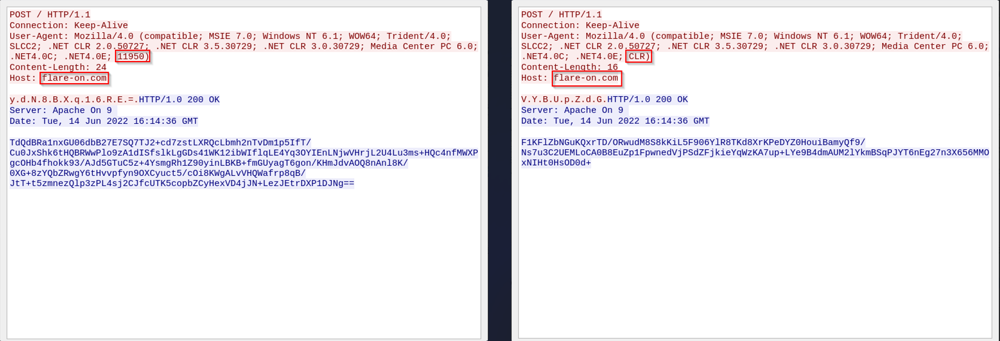

Decoding the b64 strings doesn't yield any useful data.

## Behavior

When running the executable in our Windows VM there are no suspicious run-time activities, there's no network traffic produced nor procmon detected anything out of the ordinary.

We know that it produces traffic so there's something going on, the quickest way to determine the issue is using x32dbg.

### Anti-Debugging Bypass

When running the program with a debugger the program makes a call to the "sleep" function and then just ... sleeps... for 12 hours...
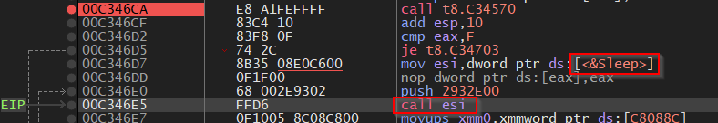

The result of function ***C346CA*** (Note: the address may vary in your machine) is compared to ***0xF*** since in out case it's not we don't take the jump and proceed to call the ***sleep*** function.

We could try to reverse function ***C346CA*** and see how we can make the comparison to be equal but another option (really lazy but efficient) is to just to patch the instruction to be jump if not ***0xF***.
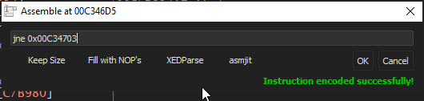

## Network Traffic Analysis

Now after setting up our network with ***inetsim*** , ***fakedns*** and ***Wireshark*** we can see network activity.

```bash
remnux@remnux:~$ fakedns
fakedns[INFO]: Response: flare-on.com -> 10.10.10.2
```

```bash
[2022-11-23 09:57:33] [1742] [http_80_tcp 1847] [10.10.10.4:4433] recv: Content-Length: 24
[2022-11-23 09:57:33] [1742] [http_80_tcp 1847] [10.10.10.4:4433] recv: Host: flare-on.com
[2022-11-23 09:57:33] [1742] [http_80_tcp 1847] [10.10.10.4:4433] recv: hn/3bLgsLyI=
...(SNIP)...
```
Wireshark gives more details on the headers.
```bash
POST / HTTP/1.1
Connection: Keep-Alive
User-Agent: Mozilla/4.0 (compatible; MSIE 7.0; Windows NT 6.2; WOW64; Trident/7.0; .NET4.0C; .NET4.0E; .NET CLR 2.0.50727; .NET CLR 3.0.30729; .NET CLR 3.5.30729; 25709)
Content-Length: 24
Host: flare-on.com

h.n./.3.b.L.g.s.L.y.I.=.
```
The User-Agent header seems to append a 5 digit random number, 
```bash
# Our test
User-Agent: ...(snip)... ; 25709)

# .pcap file
User-Agent: ...(snip)... ; 11950)
```
For now we will just take note as it could be some sort of C2 communication.

## Advanced Static Analysis

As we are analyzing a C++ executable there are plenty of things that can complicate our analysis like virtual functions, so a good place to start is using the output of capa with the '-v' argument to identify where each capability of the executable is located.

```bash
encode data using Base64 (2 matches)
namespace  data-manipulation/encoding/base64
scope      function
matches    0x4014C0
           0x401D90
```

Using this process and following the references we find a vftable of the CClientSock class we can identify the important functionalities of each function in the vftable and label them.

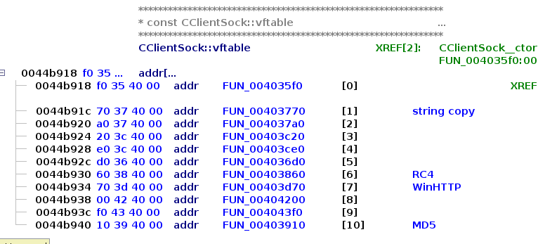

Now that we know the location of each important function we can analyze them with x32dbg.

## Advanced Dynamic Analysis

We will begin by setting breakpoints in the addresses that ***capa*** gave us and analyzing the functions responsible for the base64, MD5 and RC4 encryption using x32dbg, fakeDNS and inetsim.

### Base64

#### 0x4014c0
Using "Run til return" we can see the following value in EAX, it's the same that is sent to us in the POST request.
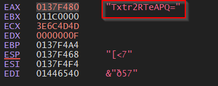

#### 0x401d90
The return value of this function is the body of our response to the POST request.
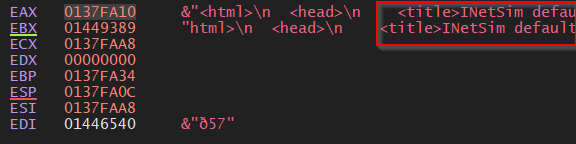

We confirm that the executable is expecting to receive b64 data.
### MD5

We can identify a string passed as an argument. 
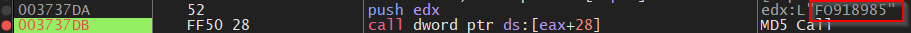

and a MD5 hash as return value.
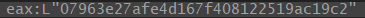

The hash is the MD5 hash of the string passed as argument.
```bash
echo -n "FO918985" | iconv -f ascii -t utf-16le | md5sum
07963e27afe4d167f408122519ac19c2
```
After testing multiple times we can observe that the value being hashed is composed of ***FO9*** concatenated with a random number.

### RC4

#### KSA

We can see the previously generated MD5 hash as an argument (NOTE: the image below shows a different hash because it changes with every run).
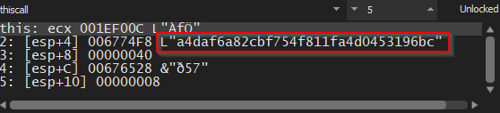

This is probably used as passphrase.

#### PRGA

We can identify the string ***ahoy*** as an argument.
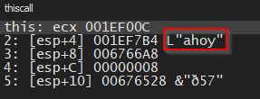

#### Testing Decryption

Having received the following POST request:
```bash
POST / HTTP/1.1
Connection: Keep-Alive
User-Agent: Mozilla/4.0 (compatible; MSIE 7.0; Windows NT 6.2; WOW64; Trident/7.0; .NET4.0C; .NET4.0E; .NET CLR 2.0.50727; .NET CLR 3.0.30729; .NET CLR 3.5.30729; 9360)
Content-Length: 24
Host: flare-on.com

Z.7.h.i.3.+.V.j.g.I.A.=.
```
We can test if it can be decrypted using the information that we now know and it works!.
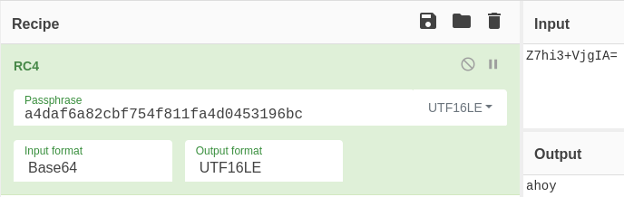

We can replicate the hash used in the POST request found in the .pcap file that we were given.
```bash
echo -n "FO911950" | iconv -f ascii -t utf-16le | md5sum
a5c6993299429aa7b900211d4a279848
```
It also works to decrypt the POST message:

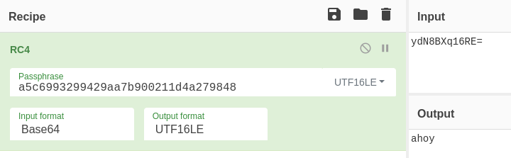

But decrypting the response doesn't give us any usable data.

## Faking the Server

We know that the executable expects a b64 response so let's try replicating the same b64 response that is present in the .pcap file using any of the following methods.

- FakeDNS + InetSim

NOTE: if using inetsim to create a .html response with Vim it is necessary to run the following commands in Vim:

```bash
:set binary
:set noeol
:wq
```

- FakeDNS + Flask

Alternatively we could use a simple Flask server.

```python
from flask import Flask
from flask import request

app = Flask(__name__)

@app.route("/", methods=["GET","POST"])
def c2():
    ua = request.headers.get('User-Agent')
    print(ua)
    print("Sending Response")

    r =  "TdQdBRa1nxGU06dbB27E7SQ7TJ2+cd7zstLXRQcLbmh2nTvDm1p5IfT/Cu0JxShk6tHQBRWwPlo9zA1dISfslkLgGDs41WK12ibWIflqLE4Yq3OYIEnLNjwVHrjL2U4Lu3ms+HQc4nfMWXPgcOHb4fhokk93/AJd5GTuC5z+4YsmgRh1Z90yinLBKB+fmGUyagT6gon/KHmJdvAOQ8nAnl8K/0XG+8zYQbZRwgY6tHvvpfyn9OXCyuct5/cOi8KWgALvVHQWafrp8qB/JtT+t5zmnezQlp3zPL4sj2CJfcUTK5copbZCyHexVD4jJN+LezJEtrDXP1DJNg=="
    return r

app.run(host='', port=80, threaded=True)
```

### Decrypting the Response

We will set breakpoints in the ***RC4 KSA*** and ***RC4 PRGA*** functions taking notice that data from our server is not received until the ***second*** hit to the ***RC4 KSA*** breakpoint.

Then we do the following:

- 1 - Hit the RC4 KSA breakpoint (the second time).
- 2 - Follow in dump the argument containing the hash.
- 3 - Select the hash in the dump window, right click > binary > edit.
- 4 - Edit the key to be the one that we reconstructed from the .pcap POST (***a5c6993299429aa7b900211d4a279848***)
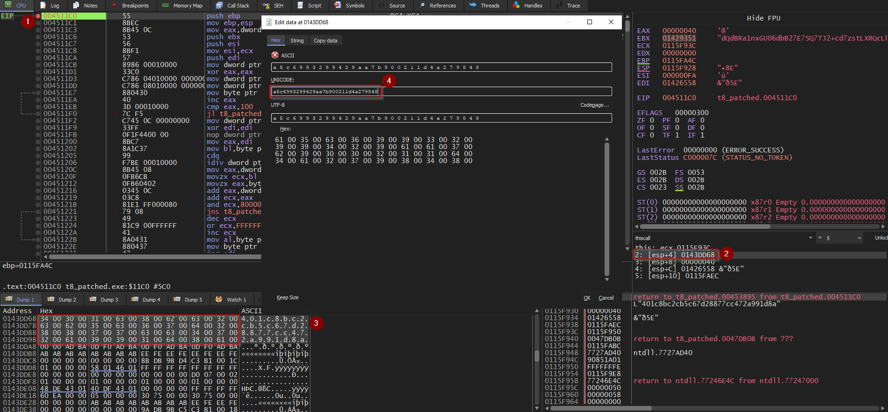

Then when the program hits the RC4 PRGA breakpoint we can dump the second argument.
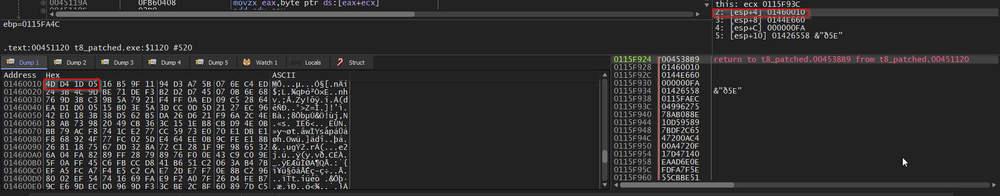

We can compare it to the data from the .pcap file and see that it't the same data.
```python
echo "TdQdBRa1nxGU06dbB27E7SQ7TJ2+cd7zstLXRQcLbmh2nTvDm1p5IfT/Cu0JxShk6tHQBRWwPlo9zA1dISfslkLgGDs41WK12ibWIflqLE4Yq3OYIEnLNjwVHrjL2U4Lu3ms+HQc4nfMWXPgcOHb4fhokk93/AJd5GTuC5z+4YsmgRh1Z90yinLBKB+fmGUyagT6gon/KHmJdvAOQ8nAnl8K/0XG+8zYQbZRwgY6tHvvpfyn9OXCyuct5/cOi8KWgALvVHQWafrp8qB/JtT+t5zmnezQlp3zPL4sj2CJfcUTK5copbZCyHexVD4jJN+LezJEtrDXP1DJNg==" | base64 -d | xxd

00000000: 4dd4 1d05 16b5 9f11 94d3 a75b 076e c4ed  M..........[.n..
00000010: 243b 4c9d be71 def3 b2d2 d745 070b 6e68  $;L..q.....E..nh
00000020: 769d 3bc3 9b5a 7921 f4ff 0aed 09c5 2864  v.;..Zy!......(d
00000030: ead1 d005 15b0 3e5a 3dcc 0d5d 2127 ec96  ......>Z=..]!'..
00000040: 42e0 183b 38d5 62b5 da26 d621 f96a 2c4e  B..;8.b..&.!.j,N
00000050: 18ab 7398 2049 cb36 3c15 1eb8 cbd9 4e0b  ..s. I.6<.....N.
...(SNIP)...
```
That confirms that we have indeed sent the correct data to the executable.
## Flag

### Tracing the vftable calls in main.

Now that we know that we are capable of decrypting the data we need to understand the flow of the program to see where that data goes.

After analyzing the main function we can trace how it's calling the vftable functions and whe can find the following:

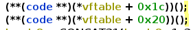

Those vftable calls point at function 403860 (***RC4***) and 403D70 (***HTTP***) respectively that checks out with the behavior that we know, the next vftable function to be called is the following:

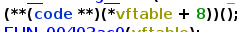

Offset 8 of the vftable is points to the function 404200 contains calls to ***_wcstok_s*** so it's doing some string manipulation, we can just set a breakpoint at it's return instruction and see what value it yields.

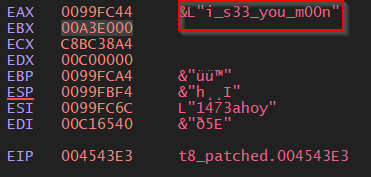

### Full Flag

If we continue debugging we eventually go back to the main function where the string is concatenated with ***@flare-on.com***.

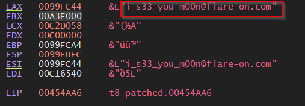

That gives us the full flag!

Lux-Sit

P.S: God I hate reversing C++ ... 