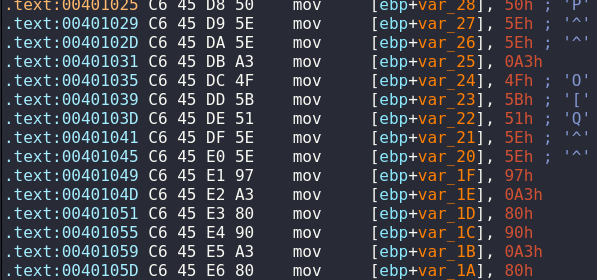
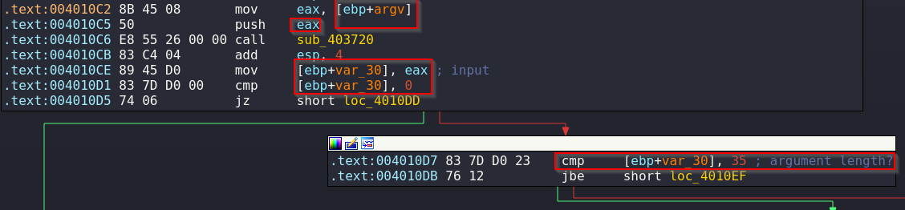
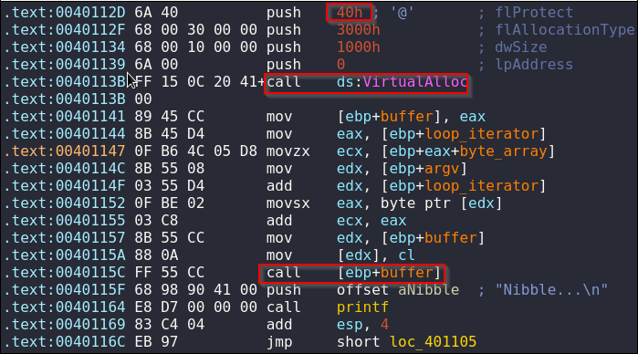

## Challenge Description
```text
“If it crashes its user error.” 
-Flare Team
```
## Challenge Overview

We are given a Windows PE32 executable.
```bash
+------------------------+------------------------------------------------------------------------------------+
| md5                    | cb530dcaf2ac705adb7553fb85c2072e                                                   |
| sha1                   | b952493b9a3590d46d37f74a1e1ef5dc170985a4                                           |
| sha256                 | 69300ed34608631e6704d04093001230772f047f8621940ce5f07a6099029f87                   |
| os                     | windows                                                                            |
| format                 | pe                                                                                 |
| arch                   | i386                                                                               |
| path                   | darn_mice.exe                                                                      |
+------------------------+------------------------------------------------------------------------------------+
```
### Imports

When looking at the imports of the executable there's one that stands out.
|Name | Function |
| --- | --- |
|bcrypt.dll | BCryptDeriveKeyPBKDF2, BCryptOpenAlgorithmProvider |

Running capa we can confirm that the executable has encryption capabilities.
```bash
remnux@remnux:~/flare/darn_mice$ capa darn_mice.exe

+-----------------------------+-------------------------------------------------------------------------------+
| MBC Objective               | MBC Behavior                                                                  |
|-----------------------------+-------------------------------------------------------------------------------|
| ANTI-STATIC ANALYSIS        | Disassembler Evasion::Argument Obfuscation [B0012.001]                        |
| CRYPTOGRAPHY                | Encrypt Data::RC4 [C0027.009]                                                 |
|                             | Generate Pseudo-random Sequence::RC4 PRGA [C0021.004]                         |
| MEMORY                      | Allocate Memory:: [C0007]                                                     |
+-----------------------------+-------------------------------------------------------------------------------+

+------------------------------------------------------+------------------------------------------------------+
| CAPABILITY                                           | NAMESPACE                                            |
|------------------------------------------------------+------------------------------------------------------|
| contain obfuscated stackstrings                      | anti-analysis/obfuscation/string/stackstring         |
| encrypt data using RC4 PRGA                          | data-manipulation/encryption/rc4                     |
| allocate RWX memory                                  | host-interaction/process/inject                      |
+------------------------------------------------------+------------------------------------------------------+
```
### Strings

There are a few interesting strings related with the executable's behavior
```bash
On your plate, you see four olives.
No, nevermind.
You leave the room, and a mouse EATS one!
Nibble...
When you return, you only: %s
salty
out != NULL check failed, %u
outlen < inlen check failed, %u
BCryptOpenAlgorithmProvider failed, %08x
BCryptDeriveKeyPBKDF2 failed, %08x
```
Can't see flag probably because it's encrypted using RC4.

### Behavior

When running the without an argument it doesn't do anything.
```bash
C:\Users\Euryale\Desktop+>darn_mice.exe

```
If we provide a command line argument it prints 2 lines of messages followed by a blank line and then it stops without doing anything more.
```bash
C:\Users\Euryale\Desktop+>darn_mice.exe lol
On your plate, you see four olives.
You leave the room, and a mouse EATS one!


```
Let's test a longer argument.
```python
>>> print("A"*100)
AAAAAAAAAAAAAAAAAAAAAAAAAAAAAAAAAAAAAAAAAAAAAAAAAAAAAAAAAAAAAAAAAAAAAAAAAAAAAAAAAAAAAAAAAAAAAAAAAAAA
>>> exit()
```

There is a line added to the response when length exceeds an unknown threshold is exceeded.
```bash
C:\Users\Euryale\Desktop+>darn_mice.exe AAAAAAAAAAAAAAAAAAAAAAAAAAAAAAAAAAAAAAAAAAAAAAAAAAAAAAAAAAAAAAAAAAAAAAAAAAAAAAAAAAAAAAAAAAAAAAAAAAAA
On your plate, you see four olives.
No, nevermind.
```

## Advanced Static Analysis
We will start by examining the main function of the executable.

It starts by moving values to a ***35*** byte array (not fully shown in the image below) that we will rename as ***byte_array***.



Next it checks if we have provided an argument, and if so it will then proceed to check if it's 35 characters long or less and printing a message that we identified before.



We now that it's comparing argv and thus labeled it so because of it's position in the stack.
```bash
argv= dword ptr  8
```
As it's a 32 bit executable each variable should take 4 bytes, taking into consideration that argv is after argc it's place in the stack should be between 4 and 8 in that way we can identify it.

### Loop

After passing the checks the program enters a loop that runs 35 times.

The main function of the loop with variables renamed is shown in the image below.



- The executable allocates a buffer with the following permissions.

|Constant| Description|
| --- | --- |
|PAGE_EXECUTE_READWRITE 0x40 | Enables execute, read-only, or read/write access to the committed region of pages. |

- Analyzing the contents of the registers we can see that the executable stores into the ***buffer*** that it just created the current byte (corresponding to the round of the iteration) of the command line argument that we have passed ***+*** the value of the byte_buffer that it initialized at the beginning of main.

```bash
buffer[0] = byte_array[i] + argv[i]
```

- And then it proceeds to call the buffer.

## Problem

We now know why the program stopped and nothing more happened even if our input was 35 or less characters long.

When calling the buffer it creates an access violation due to ***invalid instruction*** as the buffer contains the byte (from our example "lol") 0x6c + the value 0x50 from the byte_array.
```bash
argv = "lol"

argv[0] = "l" = 0x6c 
byte_array[0] = 0x50

opcode = argv[0] + byte_array[0] =  0xBC
```

## Solution

Knowing what we know we must find a way to resume the control flow of the function after the call to "buffer" as it is using a single byte we can use the RETN instruction that has the opcode 0xC3 which is also a single byte and it will pop the saved return address resuming the control flow.

That means that we must find a command line argument that satisfies the following condition:
```bash
argv[i] + byte_array[i] = 0xC3

argv[i] = (0xC3 - byte_array[i])
```
We should be able to create a python script that performs the necessary operations for us.

### Extracting values

First let's extract the values of the byte_array.
```bash
.text:00401025 C6 45 D8 50    mov     [ebp+var_28], 50h ; 'P'
.text:00401029 C6 45 D9 5E    mov     [ebp+var_27], 5Eh ; '^'
.text:0040102D C6 45 DA 5E    mov     [ebp+var_26], 5Eh ; '^'
.text:00401031 C6 45 DB A3    mov     [ebp+var_25], 0A3h
.text:00401035 C6 45 DC 4F    mov     [ebp+var_24], 4Fh ; 'O'
.text:00401039 C6 45 DD 5B    mov     [ebp+var_23], 5Bh ; '['
.text:0040103D C6 45 DE 51    mov     [ebp+var_22], 51h ; 'Q'
.text:00401041 C6 45 DF 5E    mov     [ebp+var_21], 5Eh ; '^'
.text:00401045 C6 45 E0 5E    mov     [ebp+var_20], 5Eh ; '^'
.text:00401049 C6 45 E1 97    mov     [ebp+var_1F], 97h
.text:0040104D C6 45 E2 A3    mov     [ebp+var_1E], 0A3h
.text:00401051 C6 45 E3 80    mov     [ebp+var_1D], 80h
.text:00401055 C6 45 E4 90    mov     [ebp+var_1C], 90h
.text:00401059 C6 45 E5 A3    mov     [ebp+var_1B], 0A3h
.text:0040105D C6 45 E6 80    mov     [ebp+var_1A], 80h
.text:00401061 C6 45 E7 90    mov     [ebp+var_19], 90h
.text:00401065 C6 45 E8 A3    mov     [ebp+var_18], 0A3h
.text:00401069 C6 45 E9 80    mov     [ebp+var_17], 80h
.text:0040106D C6 45 EA 90    mov     [ebp+var_16], 90h
.text:00401071 C6 45 EB A3    mov     [ebp+var_15], 0A3h
.text:00401075 C6 45 EC 80    mov     [ebp+var_14], 80h
.text:00401079 C6 45 ED 90    mov     [ebp+var_13], 90h
.text:0040107D C6 45 EE A3    mov     [ebp+var_12], 0A3h
.text:00401081 C6 45 EF 80    mov     [ebp+var_11], 80h
.text:00401085 C6 45 F0 90    mov     [ebp+var_10], 90h
.text:00401089 C6 45 F1 A3    mov     [ebp+var_F], 0A3h
.text:0040108D C6 45 F2 80    mov     [ebp+var_E], 80h
.text:00401091 C6 45 F3 90    mov     [ebp+var_D], 90h
.text:00401095 C6 45 F4 A3    mov     [ebp+var_C], 0A3h
.text:00401099 C6 45 F5 80    mov     [ebp+var_B], 80h
.text:0040109D C6 45 F6 90    mov     [ebp+var_A], 90h
.text:004010A1 C6 45 F7 A2    mov     [ebp+var_9], 0A2h
.text:004010A5 C6 45 F8 A3    mov     [ebp+var_8], 0A3h
.text:004010A9 C6 45 F9 6B    mov     [ebp+var_7], 6Bh ; 'k'
.text:004010AD C6 45 FA 7F    mov     [ebp+var_6], 7Fh
```

We can save that into a file named "array" and then proceed to transform the text to be used in a python list using the following steps.
```bash
- cat array  | awk '{print $8}' | xargs | tr ' ' ',' > array_modified

result - 50h,5Eh,5Eh,0A3h,4Fh,5Bh,51h,5Eh,5Eh,97h,0A3h,80h,90h,0A3h,80h,90h,0A3h,80h,90h,0A3h,80h,90h,0A3h,80h,90h,0A3h,80h,90h,0A3h,80h,90h,0A2h,0A3h,6Bh,7Fh
```

Now some regex using Vim.
```bash
$s/h//g
$s/,/,0x/g

result - 0x50,0x5E,0x5E,0x0A3,0x4F,0x5B,0x51,0x5E,0x5E,0x97,0x0A3,0x80,0x90,0x0A3,0x80,0x90,0x0A3,0x80,0x90,0x0A3,0x80,0x90,0x0A3,0x80,0x90,0x0A3,0x80,0x90,0x0A3,0x80,0x90,0x0A2,0x0A3,0x6B,0x7F
```

### Generating the Solution

Now let's write a python script.
```python
values = [0x50,0x5E,0x5E,0x0A3,0x4F,0x5B,0x51,0x5E,0x5E,0x97,0x0A3,0x80,0x90,0x0A3,0x80,0x90,0x0A3,0x80,0x90,0x0A3,0x80,0x90,0x0A3,0x80,0x90,0x0A3,0x80,0x90,0x0A3,0x80,0x90,0x0A2,0x0A3,0x6B,0x7F]

result = []
for b in values:
    b = chr(0xc3 - b)
    results.append(b)

>>> print(''.join(result))
```

After running the script we end up with the following string which ends up being composed of printable characters.
```bash
see three, C3 C3 C3 C3 C3 C3 C3! XD
```
## Flag

Now we just need to pass our string as a cmd argument.
```powershell
C:\Users\Euryale\Desktop+>darn_mice.exe "see three, C3 C3 C3 C3 C3 C3 C3! XD"
On your plate, you see four olives.
You leave the room, and a mouse EATS one!
Nibble...
Nibble...
Nibble...
...(SNIP)...
When you return, you only: see three, C3 C3 C3 C3 C3 C3 C3! XD
i_w0uld_l1k3_to_RETurn_this_joke@flare-on.com
```
And there's our flag!